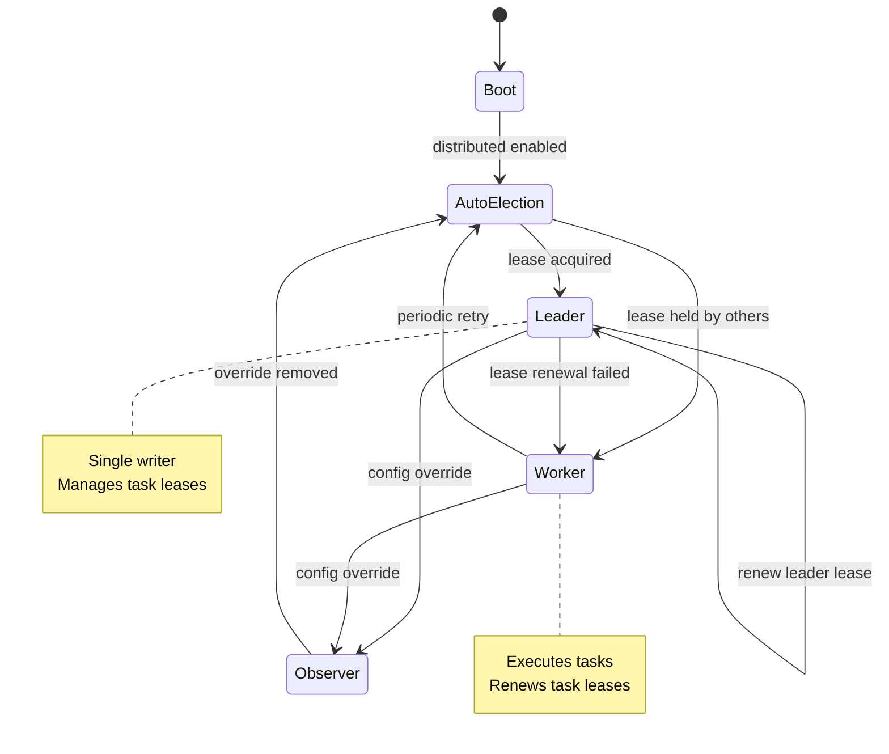

# Distributed Core — Architecture & Development Design

> Scope: Development-focused design for Distributed Core, based on `docs/development/distributed-orchestration-design.md` and current `src/` architecture. This document is implementation‑oriented and aligned with existing TaskManager/TaskExecutor patterns.

## 1. Objectives & Non‑Goals

### Objectives
- Enable **multi‑node task execution** with centralized coordination.
- Provide **lease‑based task assignment** with automatic expiry and reassignment.
- Maintain **data consistency** via **single‑writer leader** (no consensus layer).
- Use **one codebase** for all nodes (no separate coordinator/worker binaries).
- Support **auto‑scaling** by adding nodes without code changes.
- Allow **leader promotion** via configuration and automatic leader election.
- Preserve existing public APIs where possible.
- Support **placement constraints** and **executor compatibility**.
- Provide **idempotent execution** and **retries** without duplicate side effects.

### Non‑Goals
- Fully decentralized consensus (Raft/Paxos).
- Multi‑tenancy or RBAC.
- Built‑in secrets management.
- Cross‑region orchestration.

---

## 2. Single Codebase, Dynamic Roles

All nodes run the **same code**. Role is determined at runtime by configuration and leader election.

### Roles (runtime, not separate deployments)
- **Leader (single writer)**
  - Owns task state writes in PostgreSQL.
  - Handles lease acquisition/renewal and reassignment.
  - Runs cleanup for expired leases.
  - Serves read/write API endpoints.

- **Worker (stateless executor)**
  - Polls for executable tasks.
  - Acquires lease, executes, reports result.
  - Renews lease during long‑running tasks.

- **Observer (read‑only)**
  - Serves CLI or dashboard traffic.
  - Optionally runs a local cache synced from leader.

### Role selection policy
- **Default (no config required):** automatic leader election via the leader lease table.
- Optional override via config:
  - `APFLOW_NODE_ROLE=auto` (default if set): attempt leader election; fall back to worker if leader is taken.
  - `APFLOW_NODE_ROLE=leader`: force leader (fail if leadership cannot be acquired).
  - `APFLOW_NODE_ROLE=worker`: never try to become leader.
  - `APFLOW_NODE_ROLE=observer`: read‑only endpoints only.

---

## 3. Architecture Overview

**Centralized coordination, decentralized execution** with **dynamic leadership**:
- A single leader writes task state in PostgreSQL.
- All other nodes can execute tasks as workers.
- Leadership can be **promoted by config** or **acquired automatically**.
- Failures are recovered by lease expiry and reassignment.

This avoids consensus complexity while supporting auto‑scaling and leader failover.

---

## 3.1 Architecture Philosophy (Rationale)

### Why not full distributed consensus?

Distributed consensus (Raft/Paxos) adds significant complexity without clear benefit for task orchestration. A single‑writer leader provides strong consistency, while external HA (k8s/HAProxy) provides acceptable availability.

### Why lease‑based, not lock‑based?

Leases auto‑expire on node failure and prevent deadlocks. A lease renewal loop is simpler and safer than lock release semantics for distributed workers.

### Why PostgreSQL?

PostgreSQL provides the transactional primitives required for lease acquisition/renewal. DuckDB is single‑writer and is therefore unsuitable for multi‑node coordination.

---

## 4. Data Model Extensions (PostgreSQL‑only)

### Task Fields (extend `TaskModel`)
- `lease_id: Optional[str]`
- `lease_expires_at: Optional[datetime]`
- `placement_constraints: Optional[dict]`
- `attempt_id: int` (increment on retry)
- `idempotency_key: Optional[str]`
- `last_assigned_node: Optional[str]`

### New Tables

**Nodes registry**
```
 distributed_nodes(
   node_id TEXT PRIMARY KEY,
   executor_types TEXT[],
   capabilities JSONB,
   status ENUM('healthy','stale','dead'),
   heartbeat_at TIMESTAMP,
   registered_at TIMESTAMP
 )
```

**Task leases**
```
 task_leases(
   task_id TEXT PRIMARY KEY REFERENCES apflow_tasks(id),
   node_id TEXT REFERENCES distributed_nodes(node_id),
   lease_token TEXT UNIQUE,
   acquired_at TIMESTAMP,
   expires_at TIMESTAMP
 )
```

**Idempotency cache**
```
 execution_idempotency(
   task_id TEXT,
   attempt_id INT,
   idempotency_key TEXT UNIQUE,
   result JSONB,
   status ENUM('pending','completed','failed'),
   created_at TIMESTAMP,
   PRIMARY KEY (task_id, attempt_id)
 )
```

**Task events (optional, observability)**
```
 task_events(
   event_id UUID PRIMARY KEY,
   task_id TEXT REFERENCES apflow_tasks(id),
   event_type ENUM('created','assigned','started','completed','failed','reassigned','cancelled'),
   node_id TEXT,
   details JSONB,
   timestamp TIMESTAMP DEFAULT NOW()
 )
```

**Leader lease (single‑writer election)**
```
 cluster_leader(
   leader_id TEXT PRIMARY KEY,
   lease_token TEXT UNIQUE,
   acquired_at TIMESTAMP,
   expires_at TIMESTAMP
 )
```

### Leader election algorithm (SQL‑based, no config required)

**Acquire leadership (atomic):**
```
INSERT INTO cluster_leader (leader_id, lease_token, acquired_at, expires_at)
VALUES (:node_id, :lease_token, NOW(), NOW() + INTERVAL '30 seconds')
ON CONFLICT (leader_id) DO NOTHING;
```

**Renew leadership (only if you still own it):**
```
UPDATE cluster_leader
SET expires_at = NOW() + INTERVAL '30 seconds'
WHERE leader_id = :node_id AND lease_token = :lease_token;
```

**Release leadership (graceful shutdown):**
```
DELETE FROM cluster_leader
WHERE leader_id = :node_id AND lease_token = :lease_token;
```

**Acquire when stale:**
```
DELETE FROM cluster_leader WHERE expires_at < NOW();
-- then attempt acquire again
```

**Notes**:
- The first successful insert wins leadership.
- No config is required; all nodes can attempt leadership on startup and periodically after lease expiry.
- Leadership remains exclusive as long as lease renewal succeeds.

---

## 5. Core APIs (Leader)

**Protocol note:** The primary API surface is the A2A server using **JSON‑RPC** (e.g., `POST /` with JSON‑RPC payloads). Distributed endpoints should follow the same A2A JSON‑RPC conventions.

### Node Management
- `register_node(node_id, capabilities, executor_types)`
- `heartbeat(node_id)`
- `deregister_node(node_id)`

### Task Assignment
- `find_executable_tasks(node_id)`
- `acquire_lease(task_id, node_id)`
- `renew_lease(lease_token)`
- `release_lease(task_id)`

### Execution Reporting
- `report_completion(task_id, node_id, result, idempotency_key)`

### Recovery
- `recover_stale_leases()`

---

## 6. Placement Constraints

A task may specify `placement_constraints`:
- `requires_executors: list[str]`
- `requires_capabilities: dict` (e.g., `{"gpu": "nvidia"}`)
- `allowed_nodes: Optional[list[str]]`
- `forbidden_nodes: Optional[list[str]]`
- `max_parallel_per_node: int`

Placement is enforced by coordinator when returning executable tasks.

---

## 7. Execution Flow (Worker)

1. Worker polls `find_executable_tasks(node_id)`.
2. Attempts `acquire_lease(task_id)`.
3. On success, executes task locally.
4. Renews lease periodically during long tasks.
5. Reports completion (`report_completion`) with idempotency key.
6. Coordinator persists result and releases lease.

---

## 7.1 Failure Scenarios (Examples)

### Worker crash during execution
- Lease expires.
- Leader reverts task to pending and increments `attempt_id`.
- Another worker acquires the lease and retries (idempotency safe).

### Long‑running task
- Worker renews lease periodically.
- If renewal fails, task becomes eligible for reassignment after expiry.

### Leader failure
- No new leases can be granted until leader is re‑elected.
- Workers can continue current tasks; expired tasks are recovered by the next leader.

---

## 8. Idempotency Strategy

- `idempotency_key = hash(task_id + attempt_id + inputs)`.
- If record exists with `completed`, return cached result instead of re‑executing.
- Prevents duplicate side effects under retry or reassignment.

---

## 9. Module Design (Proposed)

### New Modules
- `src/apflow/core/distributed/node_registry.py`
- `src/apflow/core/distributed/lease_manager.py`
- `src/apflow/core/distributed/placement.py`
- `src/apflow/core/distributed/idempotency.py`
- `src/apflow/core/distributed/leader_election.py`
- `src/apflow/core/distributed/runtime.py` (role selection + lifecycle)

### Modified Modules
- `core/execution/task_manager.py`
  - integrate distributed execution pathway (leader/worker runtime)
- `core/execution/task_executor.py`
  - distributed runtime hooks (role‑aware entrypoints)
- `core/storage/sqlalchemy/models.py`
  - add distributed fields
- `core/storage/sqlalchemy/migrations/`
  - add migration for new tables and fields

---

## 10. Configuration

### Cluster Enablement (optional)
```
APFLOW_CLUSTER_ENABLED=true
APFLOW_NODE_ID=node-1
APFLOW_NODE_ROLE=auto   # optional override: auto | leader | worker | observer
```

### Leader Election & Leases
```
APFLOW_LEADER_LEASE=30
APFLOW_LEADER_RENEW=10
APFLOW_LEASE_DURATION=30
APFLOW_LEASE_CLEANUP_INTERVAL=10
```

### Worker Polling
```
APFLOW_POLL_INTERVAL=5
APFLOW_MAX_PARALLEL_TASKS_PER_NODE=4
```

### Default Behavior (no config)
- If distributed is enabled and PostgreSQL is configured, nodes use the **leader lease table** to elect a leader automatically.
- All nodes run the same code and can self‑promote when leadership becomes available.
- Config is only needed for explicit overrides or operational constraints.

---

## 11. Runtime State Machine



### Storage Requirements
- **Distributed mode requires PostgreSQL** (DuckDB is single-writer and unsuitable for multi-node coordination)
- **Single-node mode supports both PostgreSQL and DuckDB** (backward compatible)
- Migration scripts should detect dialect and skip distributed tables for DuckDB

---

## 12. Implementation Plan (Phased)

> **Implementation Status**: Based on analysis of current `apflow` v0.16.0 architecture. This plan provides detailed implementation guidance with code examples and integration points.

### Architecture Integration Analysis

#### Strong Alignment with Current Architecture ✅
- **Storage abstraction**: `TaskRepository` already abstracts DB operations — distributed writes can be isolated to leader
- **Hook system**: Pre/post hooks work perfectly for lease renewal and idempotency checks
- **Session management**: `SessionProxy` supports both sync and async — leader services can use async
- **Extension registry**: Distributed services can be registered as extensions
- **A2A protocol**: JSON-RPC pattern already established — distributed endpoints fit naturally

#### Areas Requiring Careful Design ⚠️
- **TaskExecutor singleton**: Currently assumes local execution — needs worker runtime mode
- **Task tree execution**: `distribute_task_tree_recursive()` assumes local dependency resolution
- **Streaming**: `EventQueue` is in-memory — needs distributed event broadcasting (Phase 5)
- **Cancellation**: Requires executor instance reference — needs distributed cancellation protocol
- **Progress tracking**: `TaskTracker` is local — needs cluster-wide tracking

---

### Phase 0 — Preparation (Week 1)

**Goal**: Ensure foundation is ready for distributed changes

**Tasks**:
1. Ensure all existing tests pass on PostgreSQL with connection pooling
2. Refactor TaskExecutor for testability (extract execution logic from singleton)
3. Document current execution flow (sequence diagrams)

**Acceptance Criteria**:
- All tests pass on PostgreSQL
- TaskExecutor can be tested with mocked dependencies
- Clear documentation of current execution flow

---

### Phase 1 — Storage & Schema (Weeks 1-2)

**Goal**: Add distributed tables and fields without changing behavior

#### Database Schema Changes

**File**: `src/apflow/core/storage/sqlalchemy/models.py`

Add these new models:
```python
class DistributedNode(Base):
    """Distributed node registry"""
    __tablename__ = "apflow_distributed_nodes"
    node_id: Mapped[str] = mapped_column(String(100), primary_key=True)
    executor_types: Mapped[list[str]] = mapped_column(JSON)
    capabilities: Mapped[dict] = mapped_column(JSON, default=dict)
    status: Mapped[str] = mapped_column(String(20))  # healthy, stale, dead
    heartbeat_at: Mapped[datetime] = mapped_column(DateTime(timezone=True))
    registered_at: Mapped[datetime] = mapped_column(DateTime(timezone=True), default=func.now())

class TaskLease(Base):
    """Task execution leases"""
    __tablename__ = "apflow_task_leases"
    task_id: Mapped[str] = mapped_column(String(100), ForeignKey("apflow_tasks.id"), primary_key=True)
    node_id: Mapped[str] = mapped_column(String(100), ForeignKey("apflow_distributed_nodes.node_id"))
    lease_token: Mapped[str] = mapped_column(String(100), unique=True, index=True)
    acquired_at: Mapped[datetime] = mapped_column(DateTime(timezone=True), default=func.now())
    expires_at: Mapped[datetime] = mapped_column(DateTime(timezone=True), index=True)
    attempt_id: Mapped[int] = mapped_column(Integer, default=0)

class ExecutionIdempotency(Base):
    """Idempotency tracking for retries"""
    __tablename__ = "apflow_execution_idempotency"
    task_id: Mapped[str] = mapped_column(String(100), primary_key=True)
    attempt_id: Mapped[int] = mapped_column(Integer, primary_key=True)
    idempotency_key: Mapped[str] = mapped_column(String(255), unique=True, index=True)
    result: Mapped[dict] = mapped_column(JSON, nullable=True)
    status: Mapped[str] = mapped_column(String(20))  # pending, completed, failed
    created_at: Mapped[datetime] = mapped_column(DateTime(timezone=True), default=func.now())

class ClusterLeader(Base):
    """Leader election lease (single row table)"""
    __tablename__ = "apflow_cluster_leader"
    leader_id: Mapped[str] = mapped_column(String(100), primary_key=True, default="singleton")
    node_id: Mapped[str] = mapped_column(String(100), ForeignKey("apflow_distributed_nodes.node_id"))
    lease_token: Mapped[str] = mapped_column(String(100), unique=True)
    acquired_at: Mapped[datetime] = mapped_column(DateTime(timezone=True), default=func.now())
    expires_at: Mapped[datetime] = mapped_column(DateTime(timezone=True), index=True)

class TaskEvent(Base):
    """Task lifecycle events for observability"""
    __tablename__ = "apflow_task_events"
    event_id: Mapped[str] = mapped_column(String(100), primary_key=True, default=lambda: str(uuid.uuid4()))
    task_id: Mapped[str] = mapped_column(String(100), ForeignKey("apflow_tasks.id", ondelete="CASCADE"), index=True)
    event_type: Mapped[str] = mapped_column(String(50))
    node_id: Mapped[str] = mapped_column(String(100), nullable=True)
    details: Mapped[dict] = mapped_column(JSON, default=dict)
    timestamp: Mapped[datetime] = mapped_column(DateTime(timezone=True), default=func.now(), index=True)
```

Extend `TaskModel` with nullable distributed fields:
```python
# Add to TaskModel (backward compatible)
lease_id: Mapped[str | None] = mapped_column(String(100), nullable=True)
lease_expires_at: Mapped[datetime | None] = mapped_column(DateTime(timezone=True), nullable=True)
placement_constraints: Mapped[dict | None] = mapped_column(JSON, nullable=True)
attempt_id: Mapped[int] = mapped_column(Integer, default=0)
idempotency_key: Mapped[str | None] = mapped_column(String(255), nullable=True)
last_assigned_node: Mapped[str | None] = mapped_column(String(100), nullable=True)
```

#### Migration Strategy

**File**: `src/apflow/core/storage/sqlalchemy/migrations/versions/00XX_add_distributed_support.py`

**Critical**: Migration must be **dialect-aware** to maintain DuckDB support in single-node mode:

```python
def upgrade() -> None:
    """Add distributed tables (PostgreSQL only)"""
    conn = op.get_bind()
    dialect_name = conn.dialect.name

    if dialect_name == "duckdb":
        # Skip distributed tables for DuckDB
        # Only add nullable columns to TaskModel
        op.add_column('apflow_tasks', sa.Column('attempt_id', sa.Integer(), server_default='0', nullable=False))
        op.add_column('apflow_tasks', sa.Column('lease_id', sa.String(100), nullable=True))
        op.add_column('apflow_tasks', sa.Column('lease_expires_at', sa.DateTime(timezone=True), nullable=True))
        op.add_column('apflow_tasks', sa.Column('placement_constraints', sa.JSON(), nullable=True))
        op.add_column('apflow_tasks', sa.Column('idempotency_key', sa.String(255), nullable=True))
        op.add_column('apflow_tasks', sa.Column('last_assigned_node', sa.String(100), nullable=True))
        return

    # PostgreSQL: create all distributed tables
    op.create_table(
        'apflow_distributed_nodes',
        # ... (as shown above)
    )
    op.create_table('apflow_task_leases', ...)
    op.create_table('apflow_execution_idempotency', ...)
    op.create_table('apflow_cluster_leader', ...)
    op.create_table('apflow_task_events', ...)

    # Add distributed columns to TaskModel
    op.add_column('apflow_tasks', sa.Column('attempt_id', sa.Integer(), server_default='0', nullable=False))
    # ... (other columns)

def downgrade() -> None:
    """Rollback distributed changes"""
    conn = op.get_bind()
    dialect_name = conn.dialect.name

    # Drop columns from TaskModel (both dialects)
    op.drop_column('apflow_tasks', 'last_assigned_node')
    # ... (other columns)

    if dialect_name == "postgresql":
        # Drop distributed tables (PostgreSQL only)
        op.drop_table('apflow_task_events')
        op.drop_table('apflow_cluster_leader')
        op.drop_table('apflow_execution_idempotency')
        op.drop_table('apflow_task_leases')
        op.drop_table('apflow_distributed_nodes')
```

**Testing**:
- Test migration on empty PostgreSQL database
- Test migration on PostgreSQL database with existing tasks
- **Test migration on DuckDB** (should only add columns, skip distributed tables)
- Verify rollback works correctly on both dialects
- Verify single-node mode works on DuckDB after migration

#### Configuration Extension

**File**: `src/apflow/core/config/registry.py`

```python
@dataclass
class DistributedConfig:
    """Distributed cluster configuration"""
    enabled: bool = False
    node_id: str | None = None
    node_role: str = "auto"  # auto | leader | worker | observer

    # Leader election
    leader_lease_seconds: int = 30
    leader_renew_seconds: int = 10

    # Task leases
    lease_duration_seconds: int = 30
    lease_cleanup_interval_seconds: int = 10

    # Worker
    poll_interval_seconds: int = 5
    max_parallel_tasks_per_node: int = 4

    # Heartbeat
    heartbeat_interval_seconds: int = 10
    node_stale_threshold_seconds: int = 30
    node_dead_threshold_seconds: int = 120

def set_distributed_config(config: DistributedConfig): ...
def get_distributed_config() -> DistributedConfig: ...
```

#### Runtime Validation

**File**: `src/apflow/core/distributed/runtime.py`

Add validation when distributed mode is enabled:

```python
class DistributedRuntime:
    def __init__(self, config: DistributedConfig, session_factory, executor):
        # Validate database dialect
        dialect = get_dialect()
        if dialect == "duckdb":
            raise ValueError(
                "Distributed mode requires PostgreSQL. "
                "DuckDB is single-writer and does not support multi-node coordination. "
                "To use DuckDB, disable distributed mode (APFLOW_CLUSTER_ENABLED=false)."
            )
        if dialect != "postgresql":
            raise ValueError(f"Distributed mode requires PostgreSQL, got: {dialect}")

        # ... rest of initialization
```

**Acceptance Criteria**:
- [ ] Migration runs successfully on PostgreSQL and DuckDB
- [ ] Existing tasks remain accessible
- [ ] No behavior changes in single-node mode
- [ ] All existing tests pass

---

### Phase 2 — Leader Services (Weeks 3-5)

**Goal**: Implement leader-only services (no execution changes yet)

#### Core Services

1. **NodeRegistry** (`src/apflow/core/distributed/node_registry.py`)
   - Register/deregister nodes
   - Track heartbeats
   - Mark stale/dead nodes
   - Query by executor types and capabilities

2. **LeaseManager** (`src/apflow/core/distributed/lease_manager.py`)
   - Atomic lease acquisition (PostgreSQL `INSERT ... WHERE NOT EXISTS`)
   - Lease renewal with token validation
   - Cleanup expired leases
   - Idempotent acquisition support

3. **LeaderElection** (`src/apflow/core/distributed/leader_election.py`)
   - Try acquire leadership (atomic insert with ON CONFLICT DO NOTHING)
   - Renew leadership lease
   - Release leadership gracefully
   - Detect leadership loss

4. **PlacementEngine** (`src/apflow/core/distributed/placement.py`)
   - Evaluate placement constraints
   - Filter eligible nodes
   - Match executor types and capabilities

5. **IdempotencyManager** (`src/apflow/core/distributed/idempotency.py`)
   - Generate idempotency keys: `hash(task_id + attempt_id + inputs)`
   - Check cached results
   - Store execution results

**Acceptance Criteria**:
- [ ] All services implemented with full type hints
- [ ] Unit tests ≥90% coverage
- [ ] Services can be instantiated independently
- [ ] Integration tests pass

---

### Phase 3 — Worker Runtime (Weeks 6-8)

**Goal**: Implement worker execution loop

#### WorkerRuntime (`src/apflow/core/distributed/worker.py`)

**Responsibilities**:
- Poll for executable tasks (status=pending, dependencies satisfied, no active lease)
- Acquire lease atomically
- Execute task locally using existing `TaskManager.distribute_task_tree()`
- Renew lease periodically during execution
- Report completion/failure
- Handle idempotency caching

**Key Flow**:
```python
async def _execute_task(self, task: TaskModel):
    # 1. Acquire lease
    lease = await self.lease_manager.acquire_lease(task.id, self.node_id)
    if not lease:
        return  # Already leased by another worker

    # 2. Start lease renewal loop (background task)
    renewal_task = asyncio.create_task(self._renew_lease_loop(task.id, lease.lease_token))

    # 3. Check idempotency cache
    idempotency_key = IdempotencyManager.generate_key(task.id, task.attempt_id, task.inputs)
    is_cached, result = await self.idempotency.check_cached_result(idempotency_key)

    if not is_cached:
        # 4. Execute task using existing TaskExecutor
        result = await self._execute_task_local(task)
        await self.idempotency.store_result(task.id, task.attempt_id, idempotency_key, result, "completed")

    # 5. Report completion
    await self._report_completion(task.id, lease.lease_token, result)

    # 6. Cleanup (cancel renewal, remove from running tasks)
```

**Acceptance Criteria**:
- [ ] Worker polls and acquires leases
- [ ] Lease renewal works for long tasks
- [ ] Idempotency prevents duplicate execution
- [ ] Heartbeat keeps node alive

---

### Phase 4 — Integration (Weeks 9-11)

**Goal**: Wire distributed services into TaskExecutor/TaskManager with role selection

#### DistributedRuntime (`src/apflow/core/distributed/runtime.py`)

**Responsibilities**:
- Role selection (auto/leader/worker/observer)
- Lifecycle management (startup/shutdown)
- Background tasks (leader renewal, lease cleanup, node cleanup)

**Role Selection Logic**:
- **auto**: Attempt leader election; fall back to worker; retry leadership periodically
- **leader**: Force leader (fail if cannot acquire)
- **worker**: Never try to become leader
- **observer**: Read-only endpoints only

#### TaskExecutor Integration

Modify `TaskExecutor.__init__`:
```python
# Initialize distributed runtime if enabled
distributed_config = get_distributed_config()
if distributed_config.enabled:
    # Validate dialect (DistributedRuntime will raise error if not PostgreSQL)
    self._distributed_runtime = DistributedRuntime(distributed_config, session_factory, self)
    asyncio.create_task(self._distributed_runtime.start())
else:
    # Single-node mode: supports both PostgreSQL and DuckDB
    self._distributed_runtime = None
```

Modify `execute_task_tree`:
```python
if self._distributed_runtime:
    if self._distributed_runtime.is_leader:
        return await self._execute_task_tree_local(...)
    else:
        raise RuntimeError("Non-leader nodes cannot execute tasks directly")
return await self._execute_task_tree_local(...)
```

#### API Layer Integration

Add leader-only checks to write operations in `TaskRoutes`:
```python
def _require_leader(self):
    if self._distributed_runtime and not self._distributed_runtime.is_leader:
        current_leader = await self._distributed_runtime.leader_election.get_current_leader()
        raise HTTPException(503, f"Write operation requires leader. Current leader: {current_leader}")
```

**Acceptance Criteria**:
- [ ] TaskExecutor initializes distributed runtime
- [ ] Role selection works correctly
- [ ] API enforces leader-only writes
- [ ] Backward compatibility preserved

---

### Phase 5 — Observability (Weeks 12-14)

**Goal**: Add comprehensive observability and end-to-end tests

#### Task Event Logging
- Emit events: created, assigned, started, completed, failed, reassigned, cancelled
- Store in `task_events` table

#### Metrics Collection
- Active leases per node
- Lease acquisition/expiry rate
- Task execution time by executor type
- Node health status
- Leader election changes

#### Integration Tests
1. Leader + 2 workers end-to-end
2. Worker crash during execution
3. Long task with lease renewal
4. Leader restart recovery
5. Placement constraints
6. Concurrent lease acquisition

**Acceptance Criteria**:
- [ ] Task events logged
- [ ] Metrics collected
- [ ] All integration tests pass
- [ ] Performance overhead ≤10%

---

## 13. Testing Strategy

### Unit Tests (≥90% Coverage)
- `test_node_registry.py`: Registration, heartbeat, status transitions
- `test_lease_manager.py`: Lease acquisition, renewal, expiry, cleanup
- `test_leader_election.py`: Leadership acquisition, renewal, loss
- `test_placement.py`: Constraint evaluation, node filtering
- `test_idempotency.py`: Key generation, caching, retrieval
- `test_worker.py`: Task polling, execution, lease renewal

### Integration Tests
- **Leader + 2 Workers**: End-to-end task distribution and execution
- **Worker Crash**: Lease expiry, task reassignment, idempotency verification
- **Long Task**: Lease renewal for 60s+ tasks
- **Leader Failover**: New leader election, stale lease cleanup
- **Placement Constraints**: Executor requirements, node filtering
- **Concurrent Acquisition**: 5 workers attempting same task

### Test Infrastructure
```python
@pytest.fixture
async def distributed_cluster():
    """Start PostgreSQL + leader + N workers"""
    # Start containers, yield cluster, teardown
```

### Code Quality Requirements (Per CLAUDE.md)
**Before each commit**:
```bash
ruff check --fix .
black .
pyright .
pytest tests/unit/distributed/ -v
pytest --cov=src/apflow/core/distributed --cov-report=term-missing
pytest tests/  # Full suite
```

**Mandatory**:
- Full type annotations (no `Any` except external data)
- Functions ≤50 lines, single responsibility
- Logging (no print statements)
- Explicit error handling (no bare except)
- Context managers for all DB sessions
- Zero ruff/black/pyright errors

---

## 14. Migration Path

### For Existing Users

**Step 1: Upgrade (No Behavior Change)**
```bash
pip install --upgrade apflow
apflow db migrate  # Adds distributed tables, but disabled by default
apflow task execute --task-id <id>  # Existing functionality unchanged
```

**Step 2: Enable Distributed Mode**
```bash
# Set environment variables
export APFLOW_CLUSTER_ENABLED=true
export APFLOW_NODE_ID=leader-01
export APFLOW_NODE_ROLE=leader

apflow server start
```

**Step 3: Add Workers Gradually**
```bash
# On worker nodes
export APFLOW_CLUSTER_ENABLED=true
export APFLOW_NODE_ID=worker-01
export APFLOW_NODE_ROLE=worker

apflow server start
```

### Backward Compatibility Guarantees
- **API**: All existing REST/A2A endpoints work unchanged
- **Data**: Existing tasks readable and executable; distributed fields nullable
- **Configuration**: Distributed mode opt-in (default: disabled)
- **Executors**: Existing executors work without changes
- **Database**:
  - **DuckDB**: Fully supported in single-node mode (distributed mode disabled)
  - **PostgreSQL**: Supported in both single-node and distributed modes
  - Migration adds only nullable columns to TaskModel for DuckDB
  - Distributed tables created only for PostgreSQL

---

## 15. Risks & Mitigations

### Technical Risks

| Risk | Impact | Likelihood | Mitigation |
|------|--------|------------|------------|
| **Leader failure causes downtime** | High | Medium | External HA (k8s/HAProxy), automatic re-election |
| **Lease starvation under high load** | Medium | Low | Ensure cleanup interval < lease duration, add metrics |
| **Duplicate execution despite idempotency** | High | Low | Comprehensive idempotency tests, atomic lease acquisition |
| **Task dependency deadlock** | Medium | Low | Dependency validation before assignment, timeout detection |
| **Performance overhead** | Medium | Medium | Benchmark each phase, optimize lease queries with indexes |
| **Data inconsistency** | High | Low | Single-writer leader, transactional updates, integration tests |
| **Network partition** | High | Low | Lease expiry handles split-brain, leader election on recovery |

### Development Risks

| Risk | Impact | Likelihood | Mitigation |
|------|--------|------------|------------|
| **Scope creep** | High | Medium | Strict phase boundaries, defer non-essential features |
| **Breaking changes** | High | Low | Comprehensive backward compatibility tests |
| **Test complexity** | Medium | High | Invest in test infrastructure (fixtures, helpers) |
| **Integration conflicts** | Medium | Medium | Frequent integration testing, CI/CD enforcement |

---

## 16. Performance Considerations

### Expected Overhead

**Single-Node Mode** (no distributed overhead):
- No changes to execution path
- No additional DB queries

**Distributed Mode (Leader)**:
- Lease table queries: +2 queries per task assignment
- Leader election renewal: +1 query every 10s
- Node status checks: +1 query every 20s
- **Estimated overhead**: ~5-10% for task assignment

**Distributed Mode (Worker)**:
- Task polling: +1 query every 5s per worker
- Lease renewal: +1 query every 10s per task
- Heartbeat: +1 query every 10s per worker
- **Estimated overhead**: Minimal (async background tasks)

### Optimization Strategies

**Critical Database Indexes**:
```sql
CREATE INDEX idx_task_leases_expires_at ON apflow_task_leases(expires_at);
CREATE INDEX idx_task_leases_node_id ON apflow_task_leases(node_id);
CREATE INDEX idx_distributed_nodes_status ON apflow_distributed_nodes(status);
CREATE INDEX idx_distributed_nodes_heartbeat ON apflow_distributed_nodes(heartbeat_at);
CREATE INDEX idx_task_events_task_id_timestamp ON apflow_task_events(task_id, timestamp);
```

**Query Optimization**:
- Batch node status updates (single `UPDATE WHERE IN`)
- Use `SELECT FOR UPDATE SKIP LOCKED` for lease acquisition
- Limit task polling queries (`TOP N WHERE status = pending`)

**Connection Pooling**:
- `SessionPoolManager` already handles pooling
- Ensure pool size ≥ max_parallel_tasks_per_node + background tasks

**Future Optimizations**:
- Cache node capabilities (TTL: 60s)
- Cache placement constraints (invalidate on task update)

---

## 17. Success Criteria

### Phase Acceptance

**Phase 0**: Foundation Ready
- [ ] All tests pass on PostgreSQL with connection pooling
- [ ] TaskExecutor refactored for testability
- [ ] Current execution flow documented

**Phase 1**: Storage Complete
- [ ] All distributed tables created
- [ ] Migration runs successfully on PostgreSQL and DuckDB
- [ ] No behavior changes in single-node mode
- [ ] All existing tests pass

**Phase 2**: Leader Services Complete
- [ ] All services implemented with full type hints
- [ ] Unit tests ≥90% coverage
- [ ] Services can be instantiated independently
- [ ] Integration tests pass

**Phase 3**: Worker Runtime Complete
- [ ] Worker polls and acquires leases correctly
- [ ] Lease renewal works for long-running tasks
- [ ] Idempotency prevents duplicate execution
- [ ] Heartbeat keeps nodes alive

**Phase 4**: Integration Complete
- [ ] TaskExecutor integrates distributed runtime
- [ ] Role selection works (auto/leader/worker/observer)
- [ ] API enforces leader-only writes
- [ ] Backward compatibility preserved

**Phase 5**: Production Ready
- [ ] Task events logged
- [ ] Metrics collected
- [ ] All integration tests pass
- [ ] Performance overhead ≤10%

### Final Acceptance

- [ ] All tests pass (unit + integration)
- [ ] Code quality checks pass (ruff, black, pyright)
- [ ] Documentation complete
- [ ] Demo environment running (leader + 2 workers)
- [ ] Migration guide validated with existing users

---

## 18. Open Questions & Future Work

### Open Questions (Resolve in Phase 1)
1. **DuckDB support in distributed mode**: Should we support distributed mode on DuckDB (via shared filesystem)?
   **Answer**: No, PostgreSQL-only for distributed mode.
   - DuckDB is single-writer and unsuitable for multi-node coordination
   - **Single-node mode will continue to support DuckDB** (backward compatible)
   - Migration scripts are dialect-aware and skip distributed tables for DuckDB

2. **Streaming events**: How to broadcast events in distributed mode?
   **Recommendation**: PostgreSQL LISTEN/NOTIFY or Redis pub/sub (defer to Phase 5).

3. **Task tree execution**: Should task tree span multiple workers or execute on single worker?
   **Recommendation**: Start with single-worker execution (simplifies dependency resolution).

### Future Work (Post-v1.0)
- **Cross-region support**: Multi-region leader election
- **Advanced scheduling**: Time-based task assignment, priority queues
- **Distributed streaming**: Real-time event broadcasting (Redis, Kafka)
- **Auto-scaling**: Dynamic worker scaling based on load
- **Multi-tenancy**: Tenant isolation for distributed tasks
- **Observability**: Grafana dashboards, Prometheus metrics
- **CLI enhancements**: `apflow cluster status`, `apflow cluster nodes`

---

## 19. Recommended First Steps

### Week 1: Preparation
1. Review existing test coverage for TaskManager/TaskExecutor
2. Set up PostgreSQL test environment
3. Create development branch: `feature/distributed-core`
4. Document current execution flow (sequence diagrams)

### Week 2: Phase 1 Start
1. Implement database models in `models.py`
2. Create Alembic migration for distributed tables
3. Add `DistributedConfig` to `ConfigRegistry`
4. Write unit tests for models
5. Verify migration on PostgreSQL

### Weeks 3-4: Phase 1 Complete + Phase 2 Start
1. Complete Phase 1 acceptance criteria
2. Implement `NodeRegistry` service
3. Implement `LeaseManager` service
4. Write comprehensive unit tests
5. Begin integration tests

---

## 20. References & Resources
- `docs/development/distributed-orchestration-design.md` — Original design document
- `docs/architecture/overview.md` — Current architecture overview
- `docs/architecture/task-tree-lifecycle.md` — Task lifecycle documentation
- `src/apflow/core/execution/task_manager.py` — Current TaskManager implementation
- `src/apflow/core/execution/task_executor.py` — Current TaskExecutor implementation
- `src/apflow/core/storage/sqlalchemy/` — Storage layer
- `CLAUDE.md` — Code quality standards and project guidelines
- `pyproject.toml` — Project configuration

---

## Summary

The distributed architecture design is **well-aligned with apflow's current architecture** and can be implemented **incrementally without disrupting existing functionality**. Key success factors:

1. **Strict phasing**: Complete each phase before moving to next
2. **Test-driven**: Write tests before implementation (≥90% coverage)
3. **Backward compatibility**: Single-node mode remains unchanged
4. **Code quality**: Follow CLAUDE.md standards rigorously
5. **Incremental validation**: Integration tests after each phase

**Estimated Timeline**: 12-14 weeks for full implementation
**Phase 1 Timeline**: 2 weeks (can validate schema early)

**Next Step**: Begin Phase 0 (preparation) to ensure foundation is solid, then proceed with Phase 1 (storage) for early feedback on schema design.
