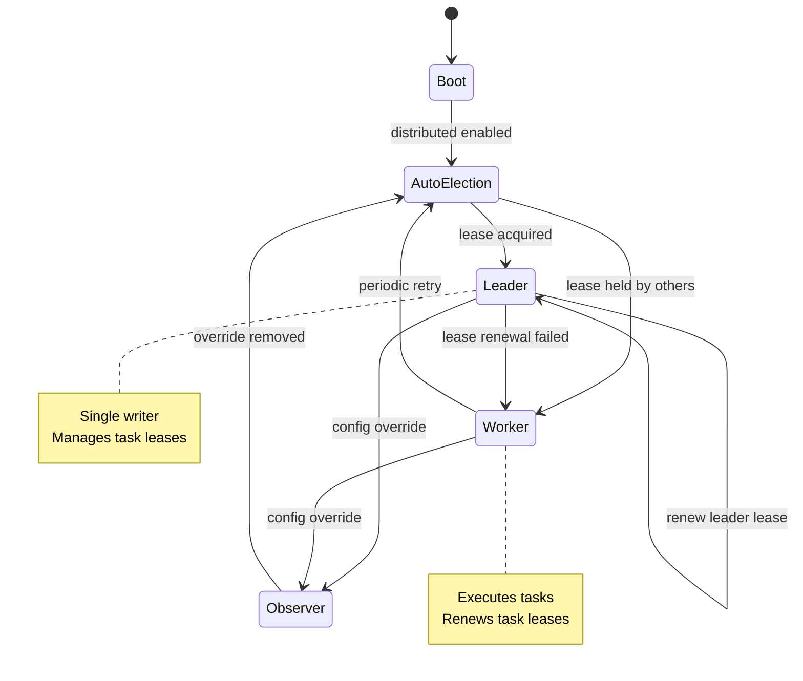

# Distributed Core — Architecture & Development Design

> Scope: Development-focused design for Distributed Core, based on `docs/development/distributed-orchestration-design.md` and current `src/` architecture. This document is implementation‑oriented and aligned with existing TaskManager/TaskExecutor patterns.

## 1. Objectives & Non‑Goals

### Objectives
- Enable **multi‑node task execution** with centralized coordination.
- Provide **lease‑based task assignment** with automatic expiry and reassignment.
- Maintain **data consistency** via **single‑writer leader** (no consensus layer).
- Use **one codebase** for all nodes (no separate coordinator/worker binaries).
- Support **auto‑scaling** by adding nodes without code changes.
- Allow **leader promotion** via configuration and automatic leader election.
- Preserve existing public APIs where possible.
- Support **placement constraints** and **executor compatibility**.
- Provide **idempotent execution** and **retries** without duplicate side effects.

### Non‑Goals
- Fully decentralized consensus (Raft/Paxos).
- Multi‑tenancy or RBAC.
- Built‑in secrets management.
- Cross‑region orchestration.

---

## 2. Single Codebase, Dynamic Roles

All nodes run the **same code**. Role is determined at runtime by configuration and leader election.

### Roles (runtime, not separate deployments)
- **Leader (single writer)**
  - Owns task state writes in PostgreSQL.
  - Handles lease acquisition/renewal and reassignment.
  - Runs cleanup for expired leases.
  - Serves read/write API endpoints.

- **Worker (stateless executor)**
  - Polls for executable tasks.
  - Acquires lease, executes, reports result.
  - Renews lease during long‑running tasks.

- **Observer (read‑only)**
  - Serves CLI or dashboard traffic.
  - Optionally runs a local cache synced from leader.

### Role selection policy
- **Default (no config required):** automatic leader election via the leader lease table.
- Optional override via config:
  - `APFLOW_NODE_ROLE=auto` (default if set): attempt leader election; fall back to worker if leader is taken.
  - `APFLOW_NODE_ROLE=leader`: force leader (fail if leadership cannot be acquired).
  - `APFLOW_NODE_ROLE=worker`: never try to become leader.
  - `APFLOW_NODE_ROLE=observer`: read‑only endpoints only.

---

## 3. Architecture Overview

**Centralized coordination, decentralized execution** with **dynamic leadership**:
- A single leader writes task state in PostgreSQL.
- All other nodes can execute tasks as workers.
- Leadership can be **promoted by config** or **acquired automatically**.
- Failures are recovered by lease expiry and reassignment.

This avoids consensus complexity while supporting auto‑scaling and leader failover.

---

## 3.1 Architecture Philosophy (Rationale)

### Why not full distributed consensus?

Distributed consensus (Raft/Paxos) adds significant complexity without clear benefit for task orchestration. A single‑writer leader provides strong consistency, while external HA (k8s/HAProxy) provides acceptable availability.

### Why lease‑based, not lock‑based?

Leases auto‑expire on node failure and prevent deadlocks. A lease renewal loop is simpler and safer than lock release semantics for distributed workers.

### Why PostgreSQL?

PostgreSQL provides the transactional primitives required for lease acquisition/renewal. DuckDB is single‑writer and is therefore unsuitable for multi‑node coordination.

---

## 4. Data Model Extensions (PostgreSQL‑only)

### Task Fields (extend `TaskModel`)
- `lease_id: Optional[str]`
- `lease_expires_at: Optional[datetime]`
- `placement_constraints: Optional[dict]`
- `attempt_id: int` (increment on retry)
- `idempotency_key: Optional[str]`
- `last_assigned_node: Optional[str]`

### New Tables

**Nodes registry**
```
 distributed_nodes(
   node_id TEXT PRIMARY KEY,
   executor_types TEXT[],
   capabilities JSONB,
   status ENUM('healthy','stale','dead'),
   heartbeat_at TIMESTAMP,
   registered_at TIMESTAMP
 )
```

**Task leases**
```
 task_leases(
   task_id TEXT PRIMARY KEY REFERENCES apflow_tasks(id),
   node_id TEXT REFERENCES distributed_nodes(node_id),
   lease_token TEXT UNIQUE,
   acquired_at TIMESTAMP,
   expires_at TIMESTAMP
 )
```

**Idempotency cache**
```
 execution_idempotency(
   task_id TEXT,
   attempt_id INT,
   idempotency_key TEXT UNIQUE,
   result JSONB,
   status ENUM('pending','completed','failed'),
   created_at TIMESTAMP,
   PRIMARY KEY (task_id, attempt_id)
 )
```

**Task events (optional, observability)**
```
 task_events(
   event_id UUID PRIMARY KEY,
   task_id TEXT REFERENCES apflow_tasks(id),
   event_type ENUM('created','assigned','started','completed','failed','reassigned','cancelled'),
   node_id TEXT,
   details JSONB,
   timestamp TIMESTAMP DEFAULT NOW()
 )
```

**Leader lease (single‑writer election)**
```
 cluster_leader(
   leader_id TEXT PRIMARY KEY,
   lease_token TEXT UNIQUE,
   acquired_at TIMESTAMP,
   expires_at TIMESTAMP
 )
```

### Leader election algorithm (SQL‑based, no config required)

**Acquire leadership (atomic):**
```
INSERT INTO cluster_leader (leader_id, lease_token, acquired_at, expires_at)
VALUES (:node_id, :lease_token, NOW(), NOW() + INTERVAL '30 seconds')
ON CONFLICT (leader_id) DO NOTHING;
```

**Renew leadership (only if you still own it):**
```
UPDATE cluster_leader
SET expires_at = NOW() + INTERVAL '30 seconds'
WHERE leader_id = :node_id AND lease_token = :lease_token;
```

**Release leadership (graceful shutdown):**
```
DELETE FROM cluster_leader
WHERE leader_id = :node_id AND lease_token = :lease_token;
```

**Acquire when stale:**
```
DELETE FROM cluster_leader WHERE expires_at < NOW();
-- then attempt acquire again
```

**Notes**:
- The first successful insert wins leadership.
- No config is required; all nodes can attempt leadership on startup and periodically after lease expiry.
- Leadership remains exclusive as long as lease renewal succeeds.

---

## 5. Core APIs (Leader)

**Protocol note:** The primary API surface is the A2A server using **JSON‑RPC** (e.g., `POST /` with JSON‑RPC payloads). Distributed endpoints should follow the same A2A JSON‑RPC conventions.

### Node Management
- `register_node(node_id, capabilities, executor_types)`
- `heartbeat(node_id)`
- `deregister_node(node_id)`

### Task Assignment
- `find_executable_tasks(node_id)`
- `acquire_lease(task_id, node_id)`
- `renew_lease(lease_token)`
- `release_lease(task_id)`

### Execution Reporting
- `report_completion(task_id, node_id, result, idempotency_key)`

### Recovery
- `recover_stale_leases()`

---

## 6. Placement Constraints

A task may specify `placement_constraints`:
- `requires_executors: list[str]`
- `requires_capabilities: dict` (e.g., `{"gpu": "nvidia"}`)
- `allowed_nodes: Optional[list[str]]`
- `forbidden_nodes: Optional[list[str]]`
- `max_parallel_per_node: int`

Placement is enforced by coordinator when returning executable tasks.

---

## 7. Execution Flow (Worker)

1. Worker polls `find_executable_tasks(node_id)`.
2. Attempts `acquire_lease(task_id)`.
3. On success, executes task locally.
4. Renews lease periodically during long tasks.
5. Reports completion (`report_completion`) with idempotency key.
6. Coordinator persists result and releases lease.

---

## 7.1 Failure Scenarios (Examples)

### Worker crash during execution
- Lease expires.
- Leader reverts task to pending and increments `attempt_id`.
- Another worker acquires the lease and retries (idempotency safe).

### Long‑running task
- Worker renews lease periodically.
- If renewal fails, task becomes eligible for reassignment after expiry.

### Leader failure
- No new leases can be granted until leader is re‑elected.
- Workers can continue current tasks; expired tasks are recovered by the next leader.

---

## 8. Idempotency Strategy

- `idempotency_key = hash(task_id + attempt_id + inputs)`.
- If record exists with `completed`, return cached result instead of re‑executing.
- Prevents duplicate side effects under retry or reassignment.

---

## 9. Module Design (Proposed)

### New Modules
- `src/apflow/core/distributed/node_registry.py`
- `src/apflow/core/distributed/lease_manager.py`
- `src/apflow/core/distributed/placement.py`
- `src/apflow/core/distributed/idempotency.py`
- `src/apflow/core/distributed/leader_election.py`
- `src/apflow/core/distributed/runtime.py` (role selection + lifecycle)

### Modified Modules
- `core/execution/task_manager.py`
  - integrate distributed execution pathway (leader/worker runtime)
- `core/execution/task_executor.py`
  - distributed runtime hooks (role‑aware entrypoints)
- `core/storage/sqlalchemy/models.py`
  - add distributed fields
- `core/storage/sqlalchemy/migrations/`
  - add migration for new tables and fields

---

## 10. Configuration

### Cluster Enablement (optional)
```
APFLOW_CLUSTER_ENABLED=true
APFLOW_NODE_ID=node-1
APFLOW_NODE_ROLE=auto   # optional override: auto | leader | worker | observer
```

### Leader Election & Leases
```
APFLOW_LEADER_LEASE_SECONDS=30
APFLOW_LEADER_RENEW_SECONDS=10
APFLOW_LEASE_DURATION_SECONDS=30
APFLOW_LEASE_CLEANUP_INTERVAL_SECONDS=10
```

### Worker Polling
```
APFLOW_POLL_INTERVAL_SECONDS=5
APFLOW_MAX_PARALLEL_TASKS_PER_NODE=4
```

### Default Behavior (no config)
- If distributed is enabled and PostgreSQL is configured, nodes use the **leader lease table** to elect a leader automatically.
- All nodes run the same code and can self‑promote when leadership becomes available.
- Config is only needed for explicit overrides or operational constraints.

---

## 11. Runtime State Machine



### Storage Requirement
- **Distributed mode requires PostgreSQL** (DuckDB is single‑writer).

---

## 12. Implementation Plan (Phased)

### Phase 1 — Storage & Schema
- Add distributed fields to TaskModel.
- Add tables: `distributed_nodes`, `task_leases`, `execution_idempotency`.
- Create Alembic migrations.

### Phase 2 — Leader Services
- Implement `NodeRegistry`, `LeaseManager`, and `LeaderElection`.
- Add cleanup job for expired leases and leader lease renewal.
- Expose leader APIs (internal service layer).

### Phase 3 — Worker Runtime
- Implement worker polling and lease acquisition.
- Add heartbeat/renew logic.
- Add idempotent execution wrapper.

### Phase 4 — Integration
- Wire into TaskExecutor/TaskManager.
- Role selection via `APFLOW_NODE_ROLE` (auto/leader/worker/observer).

### Phase 5 — Observability
- Emit task events for audit/metrics.
- Add minimal metrics hooks (lease counts, stale node count).

---

## 13. Testing Strategy

### Unit Tests
- Lease acquisition / renewal / expiry
- Placement constraints
- Node registry and heartbeat
- Idempotency caching

### Integration Tests
- Coordinator + 2 workers (end‑to‑end)
- Worker crash during execution
- Long task with lease renewal
- Coordinator restart recovery

---

## 14. Migration Path

1. **Single‑node → PostgreSQL** (no behavior change).
2. Enable distributed coordinator mode.
3. Add workers gradually.

---

## 15. Risks & Mitigations

- **Coordinator failure**: external HA (k8s/HAProxy) manages failover.
- **Lease starvation**: ensure cleanup interval < lease duration.
- **Duplicate execution**: idempotency cache + attempt_id.

---

## 16. References
- `docs/development/distributed-orchestration-design.md`
- `docs/architecture/overview.md`
- `docs/architecture/task-tree-lifecycle.md`
- `pyproject.toml`
