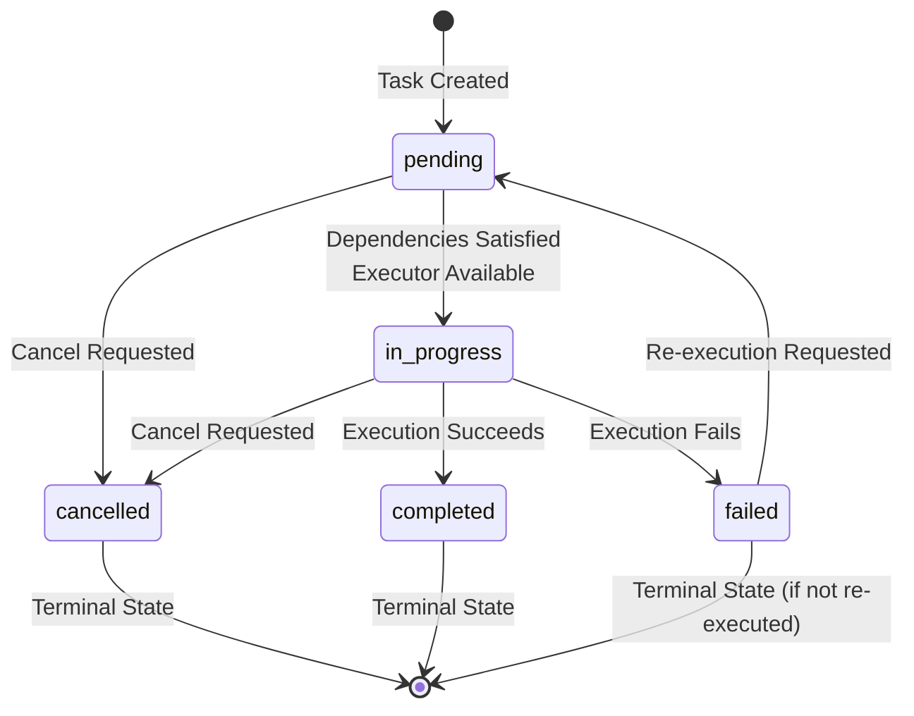

# Execution Lifecycle

The Execution Lifecycle defines how a Task transitions between states and how the system manages execution order. This specification is **mandatory** for all implementations.


## Provenance Constraints

For tasks with `origin_type` of `link` or `archive`, the referenced source task (`original_task_id`) MUST be in `completed` status (in principle) before the new task is created or executed. This ensures that only completed results are linked or snapshotted for further use.

## State Machine

A Task transitions through a well-defined set of states. Implementations **MUST** enforce valid state transitions and **MUST NOT** allow invalid transitions.

### States

| State | Value | Description |
| :--- | :--- | :--- |
| **Pending** | `pending` | The task is created but not yet started. It may be waiting for dependencies or a worker slot. |
| **In Progress** | `in_progress` | The task is currently being executed by an Executor. |
| **Completed** | `completed` | The task finished successfully. `result` field is populated. |
| **Failed** | `failed` | The task encountered an error. `error` field is populated. |
| **Cancelled** | `cancelled` | The task was manually stopped. `error` field may contain cancellation reason. |

### State Categories

- **Initial State**: `pending` (tasks start in this state)
- **Active State**: `in_progress` (task is executing)
- **Terminal States**: `completed`, `failed`, `cancelled` (task execution has ended)

### Formal State Transition Diagram



### Valid State Transitions

**MUST**: Implementations MUST only allow the following transitions:

| From | To | Condition |
| :--- | :--- | :--- |
| `pending` | `in_progress` | All dependencies satisfied, executor available |
| `pending` | `cancelled` | Cancel requested |
| `in_progress` | `completed` | Execution succeeds |
| `in_progress` | `failed` | Execution fails |
| `in_progress` | `cancelled` | Cancel requested |
| `failed` | `pending` | Re-execution requested |

**MUST NOT**: Implementations MUST NOT allow:
- Direct transition from `pending` to `completed` or `failed` (must go through `in_progress`)
- Transition from `completed` to any other state (terminal state)
- Transition from `cancelled` to any other state (terminal state, unless re-execution is explicitly supported)
- Any transition not listed above

### State Transition Conditions

#### Transition: `pending` → `in_progress`

**Conditions** (ALL must be true):
1. Task status is `pending`
2. All dependencies are satisfied (see [Dependency Resolution](#dependency-resolution))
3. An executor is available (or can be instantiated)
4. No cancellation request is pending

**Actions** (MUST be performed):
1. Set `status` to `in_progress`
2. Set `started_at` to current timestamp (ISO 8601, UTC)
3. Update `updated_at` to current timestamp
4. Invoke executor's `execute()` method with task `inputs`

#### Transition: `in_progress` → `completed`

**Conditions**:
1. Task status is `in_progress`
2. Executor's `execute()` method returns successfully
3. Result is available

**Actions** (MUST be performed):
1. Set `status` to `completed`
2. Set `result` to executor's return value
3. Set `progress` to `1.0`
4. Set `completed_at` to current timestamp (ISO 8601, UTC)
5. Update `updated_at` to current timestamp
6. Trigger dependent tasks to check if they can proceed

#### Transition: `in_progress` → `failed`

**Conditions**:
1. Task status is `in_progress`
2. Executor's `execute()` method raises an exception or returns an error

**Actions** (MUST be performed):
1. Set `status` to `failed`
2. Set `error` to error message (string)
3. Set `progress` to current progress (if available) or `0.0`
4. Set `completed_at` to current timestamp (ISO 8601, UTC)
5. Update `updated_at` to current timestamp
6. Handle dependent tasks according to dependency `required` flag

#### Transition: `in_progress` → `cancelled`

**Conditions**:
1. Task status is `in_progress`
2. Cancel request is received

**Actions** (MUST be performed):
1. Set `status` to `cancelled`
2. Set `error` to cancellation message (if provided)
3. Set `progress` to current progress (if available)
4. Set `completed_at` to current timestamp (ISO 8601, UTC)
5. Update `updated_at` to current timestamp
6. If executor supports cancellation, invoke `cancel()` method
7. Handle dependent tasks according to dependency `required` flag

#### Transition: `pending` → `cancelled`

**Conditions**:
1. Task status is `pending`
2. Cancel request is received

**Actions** (MUST be performed):
1. Set `status` to `cancelled`
2. Set `error` to cancellation message (if provided)
3. Set `completed_at` to current timestamp (ISO 8601, UTC)
4. Update `updated_at` to current timestamp
5. Handle dependent tasks according to dependency `required` flag

#### Transition: `failed` → `pending` (Re-execution)

**Conditions**:
1. Task status is `failed`
2. Re-execution is requested

**Actions** (MUST be performed):
1. Set `status` to `pending`
2. Set `error` to `null`
3. Set `progress` to `0.0`
4. Set `started_at` to `null`
5. Set `completed_at` to `null`
6. Update `updated_at` to current timestamp
7. Optionally: Reset `result` to `null` (implementation-specific)

**SHOULD**: Implementations SHOULD also handle cascading re-execution (see [Re-execution](#re-execution)).

### Invalid Transition Handling

**MUST**: If an invalid transition is attempted, implementations MUST:
1. Reject the transition
2. Keep the task in its current state
3. Return an error indicating the invalid transition

**Example Error**:
```json
{
  "error": "Invalid state transition: cannot transition from 'completed' to 'in_progress'"
}
```

## Execution Rules

### Scheduling (Triggering Only)

Scheduling **only** determines when tasks are triggered. It does **not** change dependency resolution, priority ordering, or state transition rules in this document.

**Scope rule**:
- If the **root task** has scheduling enabled, the schedule applies to the **entire task tree**.
- If only a **child task** has scheduling enabled, the schedule applies **only to that child task and its dependency chain**.

### Priority Scheduling

Tasks are executed based on their `priority` field. Lower values indicate higher priority.

#### Priority Values

| Priority | Value | Description |
| :--- | :--- | :--- |
| Urgent | `0` | Highest priority. Execute first when ready. |
| High | `1` | High priority. Execute after urgent tasks. |
| Normal | `2` | Default priority. Execute after high priority tasks. |
| Low | `3` | Lowest priority. Execute last when ready. |

#### Priority Scheduling Algorithm

When multiple tasks are ready to execute (dependencies satisfied), they MUST be scheduled according to priority:

1. **Group by Priority**: Group ready tasks by priority value.
2. **Sort Groups**: Process groups in ascending order (0, then 1, then 2, then 3).
3. **Within Group**: Tasks with the same priority MAY be executed in any order (implementation-specific, e.g., FIFO, round-robin).

**Algorithm** (pseudocode):
```
function scheduleTasks(readyTasks):
    // Group by priority
    groups = {}
    for task in readyTasks:
        priority = task.priority ?? 2  // Default: 2
        if priority not in groups:
            groups[priority] = []
        groups[priority].append(task)
    
    // Execute in priority order
    for priority in sorted(groups.keys()):
        tasks = groups[priority]
        // Execute tasks in this priority group
        // (order within group is implementation-specific)
        for task in tasks:
            executeTask(task)
```

**MUST**: Implementations MUST respect priority ordering when scheduling tasks.

**SHOULD**: Implementations SHOULD execute tasks with the same priority fairly (e.g., FIFO, round-robin).

**Note**: Priority only affects scheduling when tasks are **ready** (dependencies satisfied). Dependencies take precedence over priority.

### Dependency Resolution

A task cannot start until all its dependencies are satisfied. Dependency resolution determines when a task is ready to execute.

#### Dependency Satisfaction Rules

For a dependency to be **satisfied**:

1. **Required Dependency** (`required: true`):
   - Dependent task MUST have `status: "completed"`
   - If dependent task has `status: "failed"`, dependency is NOT satisfied, and the task MUST NOT execute.

2. **Optional Dependency** (`required: false`):
   - Dependent task MUST have a terminal status (`completed`, `failed`, or `cancelled`)
   - Task can execute regardless of whether dependency succeeded or failed.

#### Dependency Resolution Algorithm

```
function canExecute(task):
    if task.status != "pending":
        return false  // Only pending tasks can start
    
    for dependency in task.dependencies:
        dep_task = getTask(dependency.id)
        
        if dep_task.status == "pending" or dep_task.status == "in_progress":
            return false  // Dependency not ready
        
        if dependency.required == true:
            if dep_task.status != "completed":
                return false  // Required dependency failed
    
    return true  // All dependencies satisfied
```

**MUST**: Implementations MUST check all dependencies before allowing a task to transition from `pending` to `in_progress`.

**MUST**: Implementations MUST respect the `required` flag for each dependency.

#### Dependency Failure Handling

When a required dependency fails:

1. **Block Execution**: The dependent task MUST NOT execute.
2. **Status**: The dependent task remains in `pending` status.
3. **Error Propagation**: The dependent task MAY inherit error information (implementation-specific).

When an optional dependency fails:

1. **Allow Execution**: The dependent task CAN execute.
2. **Status**: The dependent task can transition to `in_progress` when other dependencies are satisfied.

### Concurrent Execution

Multiple tasks MAY execute concurrently if:
1. Their dependencies are satisfied
2. Executors are available
3. No explicit serialization constraint exists

**MUST**: Implementations MUST support concurrent execution of independent tasks.

**SHOULD**: Implementations SHOULD limit concurrent execution based on available resources (e.g., thread pool size, executor capacity).

**MAY**: Implementations MAY provide configuration for concurrency limits.

### Task Cancellation

Tasks can be cancelled at any point during execution.

#### Cancellation Rules

**MUST**:
- Implementations MUST support cancellation of `pending` and `in_progress` tasks.
- Cancellation MUST transition the task to `cancelled` status.
- Cancellation MUST set the `error` field (if a cancellation message is provided).

**SHOULD**:
- Implementations SHOULD attempt to stop executor execution when cancelling `in_progress` tasks.
- Implementations SHOULD handle dependent tasks appropriately (see [Dependency Failure Handling](#dependency-failure-handling)).

**MAY**:
- Implementations MAY support cancellation of terminal states (no-op or error).

#### Cancellation Behavior

1. **Pending Tasks**: Immediate cancellation (no executor running).
2. **In Progress Tasks**: 
   - If executor supports cancellation, invoke `cancel()` method.
   - If executor does not support cancellation, mark as cancelled but executor may continue running (implementation-specific).

#### Cancellation Impact on Dependencies

When a task is cancelled:

1. **Required Dependencies**: Tasks depending on a cancelled task with `required: true` MUST NOT execute.
2. **Optional Dependencies**: Tasks depending on a cancelled task with `required: false` CAN execute.

## Re-execution

The protocol supports re-execution of tasks. Re-execution allows failed tasks to be retried or tasks to be re-run with different inputs.

### Re-execution Rules

#### When Re-execution is Allowed

**MUST**: Implementations MUST support re-execution of tasks with status `failed`.

**SHOULD**: Implementations SHOULD support re-execution of tasks with status `completed` (for testing, debugging, or re-processing).

**MAY**: Implementations MAY support re-execution of tasks with status `cancelled`.

#### Re-execution Process

1. **Reset State**: Task status transitions from terminal state to `pending`.
2. **Clear Results**: `result` and `error` fields are reset (set to `null`).
3. **Reset Progress**: `progress` is reset to `0.0`.
4. **Reset Timestamps**: `started_at` and `completed_at` are reset to `null`.
5. **Preserve Definition**: Task definition (`name`, `inputs`, `schemas`, `dependencies`) is preserved.

#### Cascading Re-execution

When a task is re-executed, tasks that depend on it MAY need to be re-executed to ensure consistency.

**Rules**:
1. **Direct Dependents**: Tasks that directly depend on the re-executed task SHOULD be marked for re-execution if they have already completed.
2. **Transitive Dependents**: Tasks that transitively depend on the re-executed task SHOULD be marked for re-execution.
3. **Status Check**: Only tasks with terminal status (`completed`, `failed`, `cancelled`) are candidates for cascading re-execution.

**Algorithm** (pseudocode):
```
function cascadeReexecution(task):
    visited = set()
    
    function markForReexecution(current_task):
        if current_task.id in visited:
            return
        visited.add(current_task.id)
        
        if current_task.status in ["completed", "failed", "cancelled"]:
            // Reset to pending
            current_task.status = "pending"
            current_task.result = null
            current_task.error = null
            current_task.progress = 0.0
            current_task.started_at = null
            current_task.completed_at = null
        
        // Recursively mark dependents
        dependents = findDependentTasks(current_task.id)
        for dependent in dependents:
            markForReexecution(dependent)
    
    markForReexecution(task)
```

**SHOULD**: Implementations SHOULD support cascading re-execution to maintain data consistency.

**MAY**: Implementations MAY provide configuration to disable cascading re-execution.

### Copy Execution

Copy execution creates a new copy of an existing task (and optionally its children) for re-execution without modifying the original task.

#### Copy Execution Rules

**MUST**: Implementations MUST support copying tasks before execution.

**SHOULD**: Implementations SHOULD support copying task trees (task + children).

#### What Gets Copied

**Copied**:
- Task definition (`name`, `inputs`, `schemas`, `params`, `dependencies`)
- Task hierarchy (parent-child relationships)
- Dependencies (when `copy_children: true`)

**Reset**:
- `status`: Set to `pending`
- `result`: Set to `null`
- `error`: Set to `null`
- `progress`: Set to `0.0`
- `started_at`: Set to `null`
- `completed_at`: Set to `null`

**New**:
- `id`: New UUID generated
- `created_at`: Current timestamp
- `updated_at`: Current timestamp

**Preserved** (in original):
- Original task remains completely unchanged
- Original task's execution history is preserved

#### Copy Children Behavior

When `copy_children: true`:
1. Each direct child of the original task is copied.
2. All dependencies of copied children are included.
3. Tasks that depend on multiple copied children are only copied once (deduplication).

**Example**:
```
Original Tree:
- Parent (id: parent-1)
  - Child 1 (id: child-1, depends on: dep-1)
  - Child 2 (id: child-2, depends on: dep-1, dep-2)
  - Dependency 1 (id: dep-1)
  - Dependency 2 (id: dep-2)

After copy_execution=true, copy_children=true:
- Copied Parent (id: parent-1-copy)
  - Copied Child 1 (id: child-1-copy, depends on: dep-1-copy)
  - Copied Child 2 (id: child-2-copy, depends on: dep-1-copy, dep-2-copy)
  - Copied Dependency 1 (id: dep-1-copy) - copied only once!
  - Copied Dependency 2 (id: dep-2-copy)
```

## Error Handling

### Error Propagation

When a task fails, the error information is stored in the `error` field.

**MUST**: Implementations MUST set the `error` field when a task fails.

**SHOULD**: Error messages SHOULD be descriptive and include context about what failed.

### Failure Handling Strategies

#### Required Dependency Failure

When a required dependency fails:

1. **Block Execution**: Dependent task MUST NOT execute.
2. **Status**: Dependent task remains in `pending` status.
3. **Error Information**: Dependent task MAY inherit error information (implementation-specific).

#### Optional Dependency Failure

When an optional dependency fails:

1. **Allow Execution**: Dependent task CAN execute.
2. **Status**: Dependent task can transition to `in_progress` when other dependencies are satisfied.
3. **Error Information**: Dependent task MAY access dependency error information (implementation-specific).

### Retry Mechanisms

**MAY**: Implementations MAY support automatic retry of failed tasks.

**SHOULD**: If retry is supported, implementations SHOULD:
- Limit the number of retries (e.g., max 3 attempts).
- Use exponential backoff between retries.
- Provide configuration for retry behavior.

**Example Retry Configuration**:
```json
{
  "retry": {
    "max_attempts": 3,
    "backoff": "exponential",
    "initial_delay": 1.0,
    "max_delay": 60.0
  }
}
```

### Error Recovery Procedures

**MAY**: Implementations MAY provide error recovery mechanisms:

1. **Automatic Recovery**: Retry failed tasks automatically.
2. **Manual Recovery**: Allow users to manually trigger re-execution.
3. **Partial Recovery**: Resume execution from a checkpoint (if supported by executor).

## Implementation Requirements

### State Persistence

**MUST**: Implementations MUST persist task state to durable storage.

**SHOULD**: State persistence SHOULD be atomic (all-or-nothing).

**MAY**: Implementations MAY use transactions for state updates.

### State Consistency

**MUST**: Implementations MUST ensure state consistency:
- Status transitions follow the state machine rules.
- Field values are consistent with status (e.g., `result` is null when status is not `completed`).
- Timestamps are consistent (e.g., `started_at` <= `completed_at`).

### Concurrency Control

**MUST**: Implementations MUST handle concurrent state updates correctly:
- Prevent race conditions when updating task status.
- Ensure only one execution of a task at a time.
- Handle concurrent cancellation requests.

**SHOULD**: Implementations SHOULD use appropriate concurrency primitives (locks, transactions, etc.).

## See Also

- [Data Model](03-data-model.md) - Task schema and field definitions
- [Core Concepts](02-core-concepts.md) - Fundamental protocol concepts
- [Validation](09-validation.md) - Validation rules and algorithms
- [Error Handling](08-errors.md) - Error codes and handling
