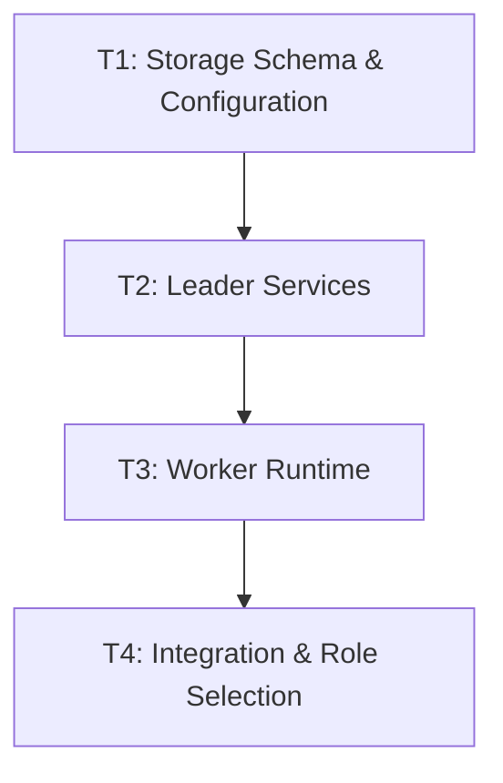

# Implementation Plan: distributed-core

## Goal

Implement multi-node task orchestration with centralized PostgreSQL coordination, lease-based task assignment, SQL-based leader election, and a worker runtime, enabling apflow to distribute task execution across multiple nodes while preserving full backward compatibility in single-node mode.

---

## Architecture Design

### Component Structure

The distributed-core feature introduces a new `src/apflow/core/distributed/` module containing six services, extends the existing storage layer with five new PostgreSQL tables and six nullable columns on `TaskModel`, and integrates with the existing `TaskExecutor`/`TaskManager` through a role-aware `DistributedRuntime` coordinator.

```
src/apflow/core/distributed/
├── __init__.py
├── node_registry.py      # Node registration, heartbeat, stale/dead detection
├── lease_manager.py       # Atomic lease acquisition, renewal, cleanup
├── leader_election.py     # SQL-based leader election with lease TTL
├── placement.py           # Placement constraint evaluation and node filtering
├── idempotency.py         # Idempotency key generation and result caching
├── runtime.py             # Role selection, lifecycle, background tasks
└── worker.py              # Worker polling, execution, lease renewal loop
```

### Data Flow

1. **Startup**: All nodes run the same codebase. `DistributedRuntime` reads `DistributedConfig`, validates the database dialect is PostgreSQL, and enters the role selection state machine (`auto` -> attempt leader election -> fallback to worker).
2. **Leader path**: The elected leader runs background tasks for leader lease renewal (every 10s, 30s TTL), expired lease cleanup, and stale node detection. It serves read/write API endpoints and manages task assignment.
3. **Worker path**: Workers register in the node registry, send heartbeats, poll `find_executable_tasks()`, atomically acquire task leases via `INSERT ... WHERE NOT EXISTS`, execute tasks using existing `TaskManager.distribute_task_tree()`, renew leases during execution, and report results with idempotency caching.
4. **Failure recovery**: Expired leases are automatically reclaimed by the leader's cleanup loop. Leader failure triggers re-election after lease TTL expires. Idempotency keys (`hash(task_id + attempt_id + inputs)`) prevent duplicate side effects on retry.

### Technical Choices with Rationale

| Decision | Choice | Rationale |
|----------|--------|-----------|
| Coordination backend | PostgreSQL (not Raft/Paxos) | Avoids consensus complexity; single-writer leader provides strong consistency; external HA (k8s) provides availability |
| Task assignment | Lease-based (not lock-based) | Leases auto-expire on node failure, preventing deadlocks; renewal loop is simpler than distributed lock release |
| Leader election | SQL `INSERT ... ON CONFLICT DO NOTHING` | Atomic, no external dependencies, leverages existing PostgreSQL connection |
| Lease acquisition | `SELECT FOR UPDATE SKIP LOCKED` | Prevents contention under concurrent workers; PostgreSQL-native |
| DuckDB strategy | Dialect-aware migration (skip distributed tables) | Preserves single-node DuckDB support; distributed mode is PostgreSQL-only |
| Role selection | Runtime env var + automatic election | Single codebase, no separate binaries; operational flexibility |
| Idempotency | Hash-based key with result cache | Prevents duplicate execution on retry/reassignment without application-level coordination |

---

## Task Breakdown

### Dependency Graph



### Task List

#### T1: Storage Schema, Data Models & Configuration (~3 days)

**Scope**: Database foundation for all distributed features.

**Deliverables**:
- Extend `TaskModel` with 6 nullable distributed fields (`lease_id`, `lease_expires_at`, `placement_constraints`, `attempt_id`, `idempotency_key`, `last_assigned_node`)
- Create 5 new SQLAlchemy models: `DistributedNode`, `TaskLease`, `ExecutionIdempotency`, `ClusterLeader`, `TaskEvent`
- Create dialect-aware Alembic migration (PostgreSQL gets full tables; DuckDB gets nullable columns only)
- Add `DistributedConfig` dataclass with all cluster/lease/worker/heartbeat settings
- Add database indexes for lease expiry, node status, and event queries
- Add runtime validation that rejects distributed mode on non-PostgreSQL dialects

**Tests (TDD)**:
- Migration succeeds on PostgreSQL (empty DB and DB with existing tasks)
- Migration succeeds on DuckDB (only adds columns, skips distributed tables)
- Rollback works correctly on both dialects
- `DistributedConfig` loads from environment variables
- All existing tests still pass (backward compatibility)
- Single-node mode unchanged on both PostgreSQL and DuckDB

**Dependencies**: None

---

#### T2: Leader Services (NodeRegistry, LeaseManager, LeaderElection, PlacementEngine, IdempotencyManager) (~5 days)

**Scope**: All leader-side coordination services, independently testable.

**Deliverables**:
- `NodeRegistry`: register/deregister nodes, heartbeat tracking, stale/dead detection, query by executor types and capabilities
- `LeaseManager`: atomic lease acquisition (`INSERT ... WHERE NOT EXISTS`), token-based renewal, expired lease cleanup, `SELECT FOR UPDATE SKIP LOCKED` for contention handling
- `LeaderElection`: atomic leadership acquisition (`INSERT ... ON CONFLICT DO NOTHING`), lease renewal (10s interval, 30s TTL), graceful release, stale leader cleanup and re-election
- `PlacementEngine`: evaluate `requires_executors`, `requires_capabilities`, `allowed_nodes`, `forbidden_nodes`, `max_parallel_per_node` constraints; filter eligible nodes
- `IdempotencyManager`: generate keys via `hash(task_id + attempt_id + inputs)`, check/store cached results, status tracking (pending/completed/failed)

**Tests (TDD)**:
- NodeRegistry: registration, heartbeat updates, status transitions (healthy -> stale -> dead), query filtering
- LeaseManager: successful acquisition, concurrent acquisition (only one wins), renewal with valid/invalid token, expiry cleanup, lease release
- LeaderElection: first node wins leadership, second node fails gracefully, renewal extends TTL, stale leader is replaced, graceful release
- PlacementEngine: constraint matching (executor types, capabilities), node filtering (allowed/forbidden), max parallel enforcement
- IdempotencyManager: key generation determinism, cache hit returns stored result, cache miss returns None, status transitions
- All services instantiable independently with injected session factory
- Unit test coverage >= 90%

**Dependencies**: T1

---

#### T3: Worker Runtime (~4 days)

**Scope**: Complete worker execution loop with lease lifecycle management.

**Deliverables**:
- `WorkerRuntime` class with async polling loop (`find_executable_tasks` -> `acquire_lease` -> execute -> report)
- Background lease renewal loop during task execution (asyncio task)
- Heartbeat loop to keep node alive in registry
- Integration with existing `TaskManager.distribute_task_tree()` for local execution
- Idempotency check before execution (return cached result if available)
- Completion/failure reporting with result persistence
- Graceful shutdown (cancel running tasks, release leases, deregister node)
- Concurrency control via `max_parallel_tasks_per_node` semaphore

**Tests (TDD)**:
- Worker polls and receives executable tasks
- Worker acquires lease atomically (concurrent workers, only one succeeds)
- Lease renewal extends expiry during long-running tasks
- Lease renewal failure stops execution gracefully
- Idempotency cache hit skips execution and returns cached result
- Heartbeat keeps node status healthy
- Graceful shutdown releases all leases and deregisters node
- Max parallel tasks enforced (semaphore blocks additional acquisitions)
- Worker crash scenario: lease expires, task becomes re-assignable

**Dependencies**: T2

---

#### T4: Integration, Role Selection & End-to-End Validation (~4 days)

**Scope**: Wire distributed services into existing TaskExecutor/TaskManager, implement role selection, enforce leader-only writes, and validate end-to-end.

**Deliverables**:
- `DistributedRuntime` coordinator: role selection state machine (auto/leader/worker/observer), lifecycle management (startup/shutdown), background task orchestration (leader renewal, lease cleanup, node cleanup)
- `TaskExecutor` integration: conditional initialization of `DistributedRuntime` when `APFLOW_CLUSTER_ENABLED=true`, route task execution through distributed or local path based on role
- API layer integration: leader-only write enforcement (`_require_leader` check on mutating endpoints), 503 response with current leader info for non-leader writes
- Task event emission: log lifecycle events (created, assigned, started, completed, failed, reassigned, cancelled) to `task_events` table
- Backward compatibility validation: single-node mode on both PostgreSQL and DuckDB unchanged

**Tests (TDD)**:
- Role selection: `auto` attempts leader then falls back to worker; `leader` fails if cannot acquire; `worker` never attempts leadership; `observer` serves read-only
- TaskExecutor initializes distributed runtime only when enabled
- Leader-only write enforcement returns 503 on non-leader nodes
- End-to-end: leader + 2 workers execute tasks correctly
- End-to-end: worker crash -> lease expiry -> reassignment -> idempotent re-execution
- End-to-end: leader failure -> re-election -> stale lease cleanup
- End-to-end: placement constraints filter eligible workers
- End-to-end: concurrent lease acquisition (5 workers, 1 task)
- Backward compatibility: all existing tests pass with distributed mode disabled
- Code quality: zero errors from ruff, black, pyright

**Dependencies**: T3

---

## Risks and Considerations

### Technical Risks

| Risk | Severity | Likelihood | Mitigation |
|------|----------|------------|------------|
| Leader failure causes task assignment downtime | High | Medium | Automatic re-election with 30s TTL; workers continue executing current tasks; external HA (k8s restart) reduces gap |
| Duplicate execution despite idempotency | High | Low | Atomic lease acquisition prevents concurrent assignment; idempotency key covers `task_id + attempt_id + inputs`; comprehensive integration tests for retry scenarios |
| Lease starvation under high load | Medium | Low | `SELECT FOR UPDATE SKIP LOCKED` prevents contention; cleanup interval (10s) < lease duration (30s); monitoring via task events |
| Data inconsistency from concurrent writes | High | Low | Single-writer leader pattern; all state mutations go through leader; transactional updates with PostgreSQL ACID guarantees |
| Network partition (split-brain) | High | Low | Lease expiry naturally resolves split-brain; only one leader can renew its lease; workers without leader connectivity eventually stop acquiring new tasks |
| Performance overhead from polling | Medium | Medium | Configurable poll interval (default 5s); `SKIP LOCKED` avoids hot-row contention; database indexes on lease expiry and task status; benchmark each phase |
| Breaking backward compatibility | High | Low | Distributed mode is opt-in (`APFLOW_CLUSTER_ENABLED=false` by default); dialect-aware migrations; all existing tests run as regression suite |

### Development Risks

| Risk | Severity | Likelihood | Mitigation |
|------|----------|------------|------------|
| Test infrastructure complexity (multi-node tests) | Medium | High | Invest in `distributed_cluster` pytest fixture early; use in-process simulation for unit tests, Docker Compose for integration |
| Scope creep into streaming/observability | Medium | Medium | Defer streaming events (LISTEN/NOTIFY) and dashboards to future work; task events table provides basic observability |
| Integration conflicts with existing TaskExecutor | Medium | Medium | Minimal changes to TaskExecutor (conditional distributed path); extensive backward compatibility tests |

---

## Acceptance Criteria

- [ ] All unit tests pass with >= 90% coverage on `src/apflow/core/distributed/`
- [ ] All existing tests pass unchanged (backward compatibility)
- [ ] Multi-node task execution works end-to-end (leader + 2 workers)
- [ ] Lease-based assignment with automatic expiry and reassignment
- [ ] Leader election and automatic failover on leader failure
- [ ] Placement constraints correctly filter eligible workers
- [ ] Idempotent execution prevents duplicate side effects on retry
- [ ] Single-node mode unchanged on both PostgreSQL and DuckDB
- [ ] Dialect-aware migration runs correctly on PostgreSQL and DuckDB
- [ ] Code quality: zero errors from `ruff check --fix .`, `black .`, `pyright .`
- [ ] All public functions have full type annotations (no `Any` except external data)
- [ ] Functions <= 50 lines, single responsibility
- [ ] Logging via `logging` module (no `print()`)
- [ ] Performance overhead <= 10% for task assignment in distributed mode
- [ ] Code review completed for all distributed modules

---

## References

- [Feature Specification](/planning/features/distributed-core.md) -- Feature requirements and acceptance criteria
- [Architecture & Development Design](/docs/development/distributed-development.md) -- Full 1050-line design document with code examples, SQL schemas, failure scenarios, and phased implementation guidance
- [TaskManager Implementation](/src/apflow/core/execution/task_manager.py) -- Current task orchestration logic (integration point)
- [TaskExecutor Implementation](/src/apflow/core/execution/task_executor.py) -- Current execution engine (integration point)
- [SQLAlchemy Models](/src/apflow/core/storage/sqlalchemy/models.py) -- Existing data models (schema extension point)
- [TaskRepository](/src/apflow/core/storage/sqlalchemy/task_repository.py) -- Storage abstraction layer
- [Storage Migrations](/src/apflow/core/storage/migrations/) -- Alembic migration infrastructure
- [CLAUDE.md](/CLAUDE.md) -- Code quality standards (mandatory compliance)
- PostgreSQL `SELECT FOR UPDATE SKIP LOCKED` -- https://www.postgresql.org/docs/current/sql-select.html#SQL-FOR-UPDATE-SHARE
- PostgreSQL `INSERT ... ON CONFLICT` -- https://www.postgresql.org/docs/current/sql-insert.html#SQL-ON-CONFLICT
