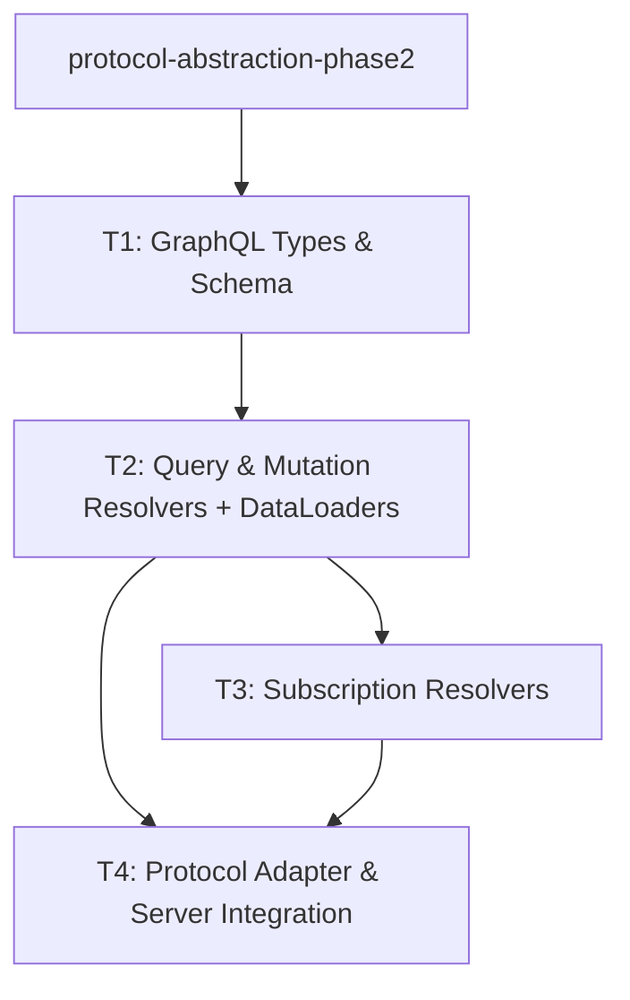

# Implementation Plan: GraphQL Adapter

## Goal

Implement a GraphQL protocol adapter using strawberry-graphql that exposes task tree queries, mutations, and subscriptions, delegating all business logic to the existing `TaskRoutes` handler layer.

## Architecture Design

### Component Structure

```
src/apflow/api/graphql/
├── __init__.py              # Package marker, exports GraphQLProtocolAdapter
├── server.py                # GraphQLProtocolAdapter (implements ProtocolAdapter)
├── schema.py                # Strawberry schema assembly (Query, Mutation, Subscription)
├── types.py                 # Strawberry type definitions (Task, TaskTree, Executor, enums)
├── resolvers/
│   ├── __init__.py
│   ├── queries.py           # Query resolvers (task, tasks, taskTree, taskChildren, etc.)
│   ├── mutations.py         # Mutation resolvers (createTask, updateTask, cancelTask, etc.)
│   └── subscriptions.py     # Subscription resolvers (taskStatusChanged, taskProgress)
└── loaders.py               # Strawberry DataLoaders for N+1 prevention
```

### Data Flow

```
Client (GraphQL query)
  → Starlette ASGI (GraphQL endpoint at /graphql)
    → Strawberry schema resolver
      → GraphQLProtocolAdapter.handle_request()
        → TaskRoutes handler method (e.g., handle_task_get, handle_tasks_list)
          → TaskRepository (SQLAlchemy)
            → Database
```

Subscriptions follow a parallel path:

```
Client (WebSocket at /graphql)
  → Strawberry subscription resolver
    → AsyncGenerator yielding from TaskStreamingContext / EventQueue
      → Real-time task status/progress updates
```

### Technical Choices with Rationale

| Decision | Choice | Rationale |
|----------|--------|-----------|
| GraphQL library | `strawberry-graphql[asgi]` | Python-first, type-safe (dataclass-based types), first-class async support, built-in ASGI integration with Starlette |
| Schema approach | Code-first (Strawberry decorators) | Aligns with project's type-annotation-first style; types are validated at import time |
| N+1 prevention | Strawberry DataLoader | Standard GraphQL pattern; strawberry has built-in DataLoader support via `Info.context` |
| Subscriptions | WebSocket via `graphql-ws` protocol | Strawberry natively supports `graphql-transport-ws`; reuses existing Starlette WebSocket |
| Adapter pattern | Follows MCP adapter pattern | Consistency with `api/mcp/adapter.py`; delegates to `TaskRoutes` handler methods via capabilities registry |
| Optional dependency | `pip install apflow[graphql]` | Follows existing pattern (`apflow[a2a]`); keeps core lightweight |

### Integration Points

1. **ProtocolAdapter interface** (from protocol-abstraction-phase2): `GraphQLProtocolAdapter` will implement the `ProtocolAdapter` Protocol, providing `protocol_name`, `supported_operations`, `handle_request()`, `create_app()`, and `get_discovery_info()`.

2. **Capabilities registry** (`api/capabilities.py`): Resolvers map GraphQL operations to `OperationDef` entries, using `get_handler_method()` to find the correct `TaskRoutes` method, identical to how `api/mcp/adapter.py` routes MCP tool calls.

3. **Protocol registry** (`api/protocols.py`): Register `"graphql"` in `PROTOCOL_DEPENDENCIES` so `create_app_by_protocol()` can instantiate the GraphQL server.

4. **App factory** (`api/app.py`): Add `create_graphql_server()` alongside `create_a2a_server()` and `create_mcp_server()`.

5. **Streaming infrastructure**: Subscriptions connect to the existing `TaskStreamingContext` and `_task_streaming_events` mechanism in `api/routes/tasks.py` for real-time updates.

## Task Breakdown

### Dependency Graph



### Task List

#### T1: Define GraphQL Types and Schema

**Estimated time**: 3-4 hours

**Dependencies**: protocol-abstraction-phase2 (ProtocolAdapter interface must exist)

**Scope**:
- **TDD**: Write schema validation tests first
  - Test that all GraphQL types resolve correctly
  - Test enum mapping between `TaskStatus` constants and GraphQL `TaskStatusEnum`
  - Test input type validation for `CreateTaskInput` and `UpdateTaskInput`
  - Test that schema introspection returns expected types and fields
- Create `types.py` with Strawberry type definitions:
  - `TaskType` mapping from `TaskModel` fields (id, name, status, priority, progress, result, error, created_at, updated_at)
  - `TaskTreeType` with root, totalTasks, completedTasks, failedTasks
  - `ExecutorType` for executor information
  - `TaskStatusEnum` mapped from `core/types.py::TaskStatus`
  - `CreateTaskInput` and `UpdateTaskInput` input types
- Create `schema.py` that assembles Query, Mutation, and Subscription type stubs into `strawberry.Schema`
- Converter functions: `task_model_to_graphql()` for translating TaskModel instances to Strawberry types

**Files created**:
- `src/apflow/api/graphql/__init__.py`
- `src/apflow/api/graphql/types.py`
- `src/apflow/api/graphql/schema.py`
- `src/apflow/api/graphql/resolvers/__init__.py`
- `tests/unit/api/graphql/__init__.py`
- `tests/unit/api/graphql/test_types.py`
- `tests/unit/api/graphql/test_schema.py`

---

#### T2: Implement Query and Mutation Resolvers with DataLoaders

**Estimated time**: 5-6 hours

**Dependencies**: T1

**Scope**:
- **TDD**: Write resolver tests first (mock TaskRoutes)
  - Test each query resolver returns correct types
  - Test each mutation resolver delegates to correct TaskRoutes method
  - Test DataLoader batches child-task lookups (verify N+1 prevention)
  - Test error handling (task not found, validation errors map to GraphQL errors)
  - Test pagination parameters (limit, offset) on `tasks` query
- Implement `resolvers/queries.py`:
  - `task(id)` -> `TaskRoutes.handle_task_get()`
  - `tasks(status, limit, offset)` -> `TaskRoutes.handle_tasks_list()`
  - `taskTree(rootId)` -> `TaskRoutes.handle_task_get()` + tree assembly
  - `taskChildren(parentId)` -> `TaskRoutes.handle_tasks_list()` with parent filter
  - `runningTasks` -> `TaskRoutes.handle_running_tasks_list()`
  - `executors` -> `TaskRoutes.handle_executors_list()` (if available)
- Implement `resolvers/mutations.py`:
  - `createTask(input)` -> `TaskRoutes.handle_task_create()`
  - `updateTask(id, input)` -> `TaskRoutes.handle_task_update()`
  - `cancelTask(id)` -> `TaskRoutes.handle_task_cancel()`
  - `deleteTask(id)` -> `TaskRoutes.handle_task_delete()`
  - `executeTask(id, inputs)` -> `TaskRoutes.handle_task_execute()`
- Implement `loaders.py`:
  - `TaskChildrenLoader`: batch-loads children for a list of parent task IDs
  - `TaskByIdLoader`: batch-loads tasks by ID for dependency resolution
  - Loader factory injected via Strawberry `Info.context`

**Files created/modified**:
- `src/apflow/api/graphql/resolvers/queries.py`
- `src/apflow/api/graphql/resolvers/mutations.py`
- `src/apflow/api/graphql/loaders.py`
- `tests/unit/api/graphql/test_queries.py`
- `tests/unit/api/graphql/test_mutations.py`
- `tests/unit/api/graphql/test_loaders.py`

---

#### T3: Implement Subscription Resolvers

**Estimated time**: 3-4 hours

**Dependencies**: T2

**Scope**:
- **TDD**: Write subscription tests first
  - Test `taskStatusChanged` yields updates when task status changes
  - Test `taskProgress` yields progress updates during execution
  - Test subscription cleanup on client disconnect
  - Test WebSocket connection lifecycle (connect, subscribe, receive, close)
- Implement `resolvers/subscriptions.py`:
  - `taskStatusChanged(taskId)` -> async generator polling `TaskStreamingContext` or database
  - `taskProgress(taskId)` -> async generator yielding from `_task_streaming_events`
  - Connect to existing `TaskStreamingContext` / `get_task_streaming_events()` infrastructure
- Integration with Strawberry's subscription system (`@strawberry.subscription` decorator)
- WebSocket transport configuration (use `graphql-transport-ws` sub-protocol)

**Files created/modified**:
- `src/apflow/api/graphql/resolvers/subscriptions.py`
- `tests/unit/api/graphql/test_subscriptions.py`

---

#### T4: Protocol Adapter, Server Integration, and End-to-End Tests

**Estimated time**: 4-5 hours

**Dependencies**: T2, T3

**Scope**:
- **TDD**: Write integration tests first
  - Test `GraphQLProtocolAdapter` implements `ProtocolAdapter` interface
  - Test `create_app()` returns working ASGI application
  - Test GraphQL endpoint responds to POST /graphql
  - Test GraphiQL playground available in dev mode
  - Test `create_app_by_protocol("graphql")` works end-to-end
  - Test full query/mutation cycle through ASGI test client
- Implement `server.py`:
  - `GraphQLProtocolAdapter` class implementing `ProtocolAdapter`
  - `protocol_name = "graphql"`
  - `create_app(task_routes)` -> assembles Strawberry schema + ASGI app with DataLoader context
  - `get_discovery_info()` -> returns GraphQL-specific discovery metadata
  - GraphiQL playground toggle (enabled when `APFLOW_ENABLE_DOCS=true`)
- Register in `api/protocols.py`:
  - Add `"graphql"` to `PROTOCOL_DEPENDENCIES` dict
- Update `api/app.py`:
  - Add `create_graphql_server()` function
  - Add `"graphql"` case to `create_app_by_protocol()`
- Add optional dependency in `pyproject.toml`:
  - `graphql = ["strawberry-graphql[asgi]>=0.230.0"]`
- End-to-end integration tests with `httpx.AsyncClient` + Starlette `TestClient`

**Files created/modified**:
- `src/apflow/api/graphql/server.py`
- `src/apflow/api/protocols.py` (modified)
- `src/apflow/api/app.py` (modified)
- `pyproject.toml` (modified)
- `tests/unit/api/graphql/test_server.py`
- `tests/integration/api/graphql/__init__.py`
- `tests/integration/api/graphql/test_graphql_e2e.py`

## Risks and Considerations

### Technical Challenges

1. **Dependency on protocol-abstraction-phase2**: The `ProtocolAdapter` Protocol does not exist yet. T1 is blocked until phase 2 defines and merges the interface. Mitigation: T1 can begin types/schema work in parallel; the adapter implementation (T4) is the hard dependency.

2. **Strawberry-to-TaskRoutes type mapping**: `TaskRoutes` handler methods accept `Dict[str, Any]` params and return `Dict`/`JSONResponse`. Strawberry resolvers work with typed dataclasses. The adapter layer must handle serialization/deserialization carefully, including edge cases like `None` vs missing fields and JSON scalar types.

3. **N+1 query performance in deep trees**: DataLoaders batch within a single GraphQL execution, but deeply nested trees (10+ levels) may still produce many batched queries. Consider adding a `maxDepth` query parameter and schema-level depth limiting to prevent abuse.

4. **Subscription backpressure**: If a client is slow to consume WebSocket messages, the async generator may buffer unboundedly. Implement a bounded queue with drop-oldest semantics for subscription event delivery.

5. **Schema evolution**: GraphQL schemas are a public API contract. Changes to `TaskModel` fields must be coordinated with the GraphQL schema to avoid breaking clients. Consider schema versioning or deprecation annotations from the start.

6. **Testing complexity for WebSocket subscriptions**: Subscription tests require a running ASGI server with WebSocket support. Use `starlette.testclient.TestClient` with `with client.websocket_connect()` for integration tests, and mock the async generators for unit tests.

7. **Optional dependency isolation**: All `strawberry-graphql` imports must be guarded behind try/except or lazy imports to prevent `ImportError` when the `graphql` extra is not installed. Follow the pattern used by `api/mcp/` modules.

## Acceptance Criteria

- [ ] All unit tests pass (`pytest tests/unit/api/graphql/`)
- [ ] All integration tests pass (`pytest tests/integration/api/graphql/`)
- [ ] Test coverage >= 90% on `src/apflow/api/graphql/`
- [ ] `ruff check --fix .` reports zero issues
- [ ] `black .` reports no formatting changes needed
- [ ] `pyright .` reports zero type errors in graphql module
- [ ] GraphQL schema covers all task operations (CRUD, execute, tree queries)
- [ ] Queries resolve task trees efficiently (DataLoader prevents N+1)
- [ ] Mutations delegate correctly to TaskRoutes handler methods
- [ ] Subscriptions deliver real-time task status and progress updates via WebSocket
- [ ] `GraphQLProtocolAdapter` implements `ProtocolAdapter` interface
- [ ] Available via `pip install apflow[graphql]`
- [ ] GraphiQL playground available when `APFLOW_ENABLE_DOCS=true`
- [ ] `create_app_by_protocol("graphql")` produces a working ASGI app
- [ ] All existing API tests pass unchanged (no regressions)
- [ ] Code reviewed and approved

## References

- [Strawberry GraphQL Documentation](https://strawberry.rocks/docs)
- [Strawberry ASGI Integration](https://strawberry.rocks/docs/integrations/asgi)
- [Strawberry Subscriptions](https://strawberry.rocks/docs/general/subscriptions)
- [Strawberry DataLoaders](https://strawberry.rocks/docs/guides/dataloaders)
- [GraphQL Specification](https://spec.graphql.org/)
- Feature specification: `planning/features/graphql-adapter.md`
- Dependency specification: `planning/features/protocol-abstraction-phase2.md`
- MCP adapter reference (pattern to follow): `src/apflow/api/mcp/adapter.py`
- MCP server reference: `src/apflow/api/mcp/server.py`
- TaskRoutes (delegation target): `src/apflow/api/routes/tasks.py`
- Capabilities registry: `src/apflow/api/capabilities.py`
- Protocol registry: `src/apflow/api/protocols.py`
- App factory: `src/apflow/api/app.py`
