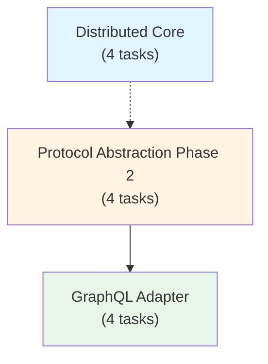

# apflow - Implementation Overview

> Project-level overview of all planned features and their implementation status.

## Overall Progress

```
[====================] 12/12 tasks (100%)
```

| Status | Count |
|--------|-------|
| Completed | 12 |
| In Progress | 0 |
| Pending | 0 |

## Module Overview

| # | Module | Description | Status | Progress |
|---|--------|-------------|--------|----------|
| 1 | [protocol-abstraction-phase2](./protocol-abstraction-phase2/) | Formal ProtocolAdapter interface for unified protocol handling | completed | 4/4 |
| 2 | [distributed-core](./distributed-core/) | Multi-node task orchestration with centralized coordination | completed | 4/4 |
| 3 | [graphql-adapter](./graphql-adapter/) | GraphQL query interface for complex task trees | completed | 4/4 |

## Module Dependencies



## Recommended Implementation Order

### Phase 1: Protocol Abstraction Phase 2
**Why first**: Establishes the `ProtocolAdapter` interface that GraphQL Adapter depends on. Also provides a cleaner architecture for any future protocol additions. Relatively small scope (~15h), quick win.

### Phase 2: Distributed Core (can run in parallel with Phase 1)
**Why parallel**: Independent of Protocol Abstraction. Largest feature (~16 days), benefits from early start. Has its own phased internal structure (storage -> services -> worker -> integration).

### Phase 3: GraphQL Adapter
**Why last**: Depends on Protocol Abstraction Phase 2 being complete (needs `ProtocolAdapter` interface). Medium scope (~16h), builds on patterns established by MCP adapter.

## Quick Links

- [Protocol Abstraction Phase 2 Plan](./protocol-abstraction-phase2/plan.md)
- [Distributed Core Plan](./distributed-core/plan.md)
- [GraphQL Adapter Plan](./graphql-adapter/plan.md)
- [Feature Documents](../features/)
