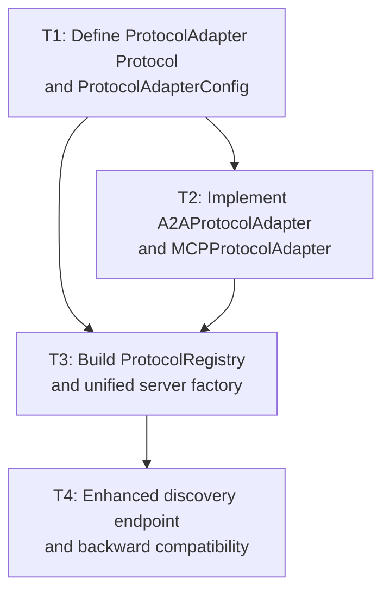

# Implementation Plan: Protocol Abstraction Phase 2

## Goal

Formalize the `ProtocolAdapter` interface using PEP 544 `typing.Protocol`, refactor existing A2A and MCP adapters to conform to it, and introduce a protocol registry with unified server factory so that adding new protocols requires only implementing the `ProtocolAdapter` interface.

## Architecture Design

### Component Structure

```
src/apflow/api/
  protocols.py          # Extended: ProtocolAdapter Protocol + ProtocolRegistry
  app.py                # Refactored: uses ProtocolRegistry + unified server factory
  capabilities.py       # Unchanged (already protocol-agnostic)
  routes/tasks.py       # Unchanged (already protocol-agnostic)
  a2a/
    adapter.py          # NEW: A2AProtocolAdapter implementing ProtocolAdapter
    server.py           # Minimal changes (adapter delegates to existing logic)
  mcp/
    adapter.py          # EXISTING: renamed/refactored to MCPProtocolAdapter
    server.py           # Minimal changes (adapter delegates to existing McpServer)
```

### Data Flow

```
User / CLI / Programmatic call
        |
        v
  create_app_by_protocol(protocol="a2a")
        |
        v
  ProtocolRegistry.get_adapter("a2a")  -->  A2AProtocolAdapter instance
        |
        v
  adapter.create_app(config)  -->  Starlette/FastAPI app
        |
        v
  adapter.handle_request(operation_id, params)  -->  delegates to TaskRoutes
```

### Technical Choices with Rationale

1. **`typing.Protocol` (PEP 544) for `ProtocolAdapter`** -- Structural subtyping allows adapters to satisfy the interface without explicit inheritance. This keeps adapters loosely coupled and testable via duck typing. Matches the project's existing preference for Protocols over ABC inheritance.

2. **Strategy pattern with registry dict** -- The `ProtocolRegistry` maintains a `dict[str, type[ProtocolAdapter]]` mapping. This replaces the current `if/elif` chain in `create_app_by_protocol` with a single lookup, making protocol addition O(1) code change (register one class).

3. **Adapter wraps existing server logic** -- Rather than rewriting `a2a/server.py` and `mcp/server.py`, each adapter class wraps the existing creation functions. This preserves backward compatibility and minimizes risk.

4. **`ProtocolAdapterConfig` dataclass for configuration** -- A shared config dataclass carries common parameters (base_url, enable_docs, jwt settings, etc.) so that adapters receive a uniform config object rather than ad-hoc kwargs.

5. **Discovery info per adapter** -- Each adapter exposes `get_discovery_info()` returning its supported operations and status, enabling the enhanced `/tasks/methods` endpoint to report per-protocol availability.

### Key Interfaces

```python
from typing import Protocol, Any, AsyncIterator, runtime_checkable
from dataclasses import dataclass

@dataclass
class ProtocolAdapterConfig:
    """Shared configuration for all protocol adapters."""
    base_url: str
    enable_system_routes: bool
    enable_docs: bool
    jwt_secret_key: str | None
    jwt_algorithm: str
    task_routes_class: type | None
    custom_routes: list | None
    custom_middleware: list | None
    verify_token_func: Any | None
    verify_permission_func: Any | None

@runtime_checkable
class ProtocolAdapter(Protocol):
    """Protocol interface that all protocol adapters must implement."""

    @property
    def protocol_name(self) -> str: ...

    @property
    def supported_operations(self) -> list[str]: ...

    def create_app(self, config: ProtocolAdapterConfig) -> Any: ...

    async def handle_request(self, operation_id: str, params: dict) -> dict: ...

    async def handle_streaming_request(
        self, operation_id: str, params: dict
    ) -> AsyncIterator[dict]: ...

    def get_discovery_info(self) -> dict: ...


class ProtocolRegistry:
    """Registry for protocol adapters -- discovers, validates, instantiates."""

    def register(self, adapter_class: type[ProtocolAdapter]) -> None: ...
    def get_adapter(self, protocol: str) -> ProtocolAdapter: ...
    def list_protocols(self) -> list[str]: ...
    def get_discovery(self) -> dict[str, dict]: ...
```

## Task Breakdown

### Dependency Graph



### Task List

#### T1: Define ProtocolAdapter Protocol and ProtocolAdapterConfig (~3h)

**Dependencies**: none

**Description**: Define the formal `ProtocolAdapter` Protocol (PEP 544) and the `ProtocolAdapterConfig` dataclass in `src/apflow/api/protocols.py`. This is the foundational interface that all subsequent work builds on.

**TDD approach** (write tests first):
- `tests/api/test_protocol_adapter.py`:
  - Test that a minimal conforming class passes `isinstance(obj, ProtocolAdapter)` via `@runtime_checkable`
  - Test that a non-conforming class fails the check
  - Test `ProtocolAdapterConfig` construction with defaults and overrides
  - Test that `ProtocolAdapter` requires all six members (protocol_name, supported_operations, create_app, handle_request, handle_streaming_request, get_discovery_info)

**Implementation**:
- Add `ProtocolAdapter` Protocol class to `protocols.py` with `@runtime_checkable`
- Add `ProtocolAdapterConfig` dataclass to `protocols.py`
- Keep all existing functions in `protocols.py` unchanged (backward compatibility)

**Files modified**: `src/apflow/api/protocols.py`
**Files created**: `tests/api/test_protocol_adapter.py`

---

#### T2: Implement A2AProtocolAdapter and MCPProtocolAdapter (~5h)

**Dependencies**: T1

**Description**: Create concrete adapter classes that implement `ProtocolAdapter` by wrapping the existing A2A and MCP server creation logic. Each adapter delegates to the existing server modules, preserving all current behavior.

**TDD approach** (write tests first):
- `tests/api/a2a/test_a2a_adapter.py`:
  - Test `A2AProtocolAdapter` satisfies `ProtocolAdapter` interface
  - Test `protocol_name` returns `"a2a"`
  - Test `supported_operations` returns agent action operation IDs
  - Test `create_app` produces a callable ASGI app
  - Test `get_discovery_info` returns correct structure
  - Test `handle_request` delegates to TaskRoutes correctly
- `tests/api/mcp/test_mcp_adapter.py`:
  - Test `MCPProtocolAdapter` satisfies `ProtocolAdapter` interface
  - Test `protocol_name` returns `"mcp"`
  - Test `supported_operations` returns all 15 operation IDs
  - Test `create_app` produces a FastAPI app
  - Test `get_discovery_info` returns correct structure
  - Test `handle_request` delegates to McpServer correctly

**Implementation**:
- Create `src/apflow/api/a2a/protocol_adapter.py` with `A2AProtocolAdapter` class
  - Wraps `create_a2a_server()` in `create_app()`
  - Maps `handle_request()` to agent executor dispatch
  - Reports agent action operations from capabilities registry
- Create `src/apflow/api/mcp/protocol_adapter.py` with `MCPProtocolAdapter` class
  - Wraps `McpServer` + FastAPI creation in `create_app()`
  - Maps `handle_request()` to MCP tool dispatch via `McpServer.handle_request()`
  - Reports all operations from capabilities registry

**Files created**: `src/apflow/api/a2a/protocol_adapter.py`, `src/apflow/api/mcp/protocol_adapter.py`, `tests/api/a2a/test_a2a_adapter.py`, `tests/api/mcp/test_mcp_adapter.py`

---

#### T3: Build ProtocolRegistry and Unified Server Factory (~4h)

**Dependencies**: T1, T2

**Description**: Implement the `ProtocolRegistry` class and refactor `create_app_by_protocol()` in `app.py` to use the registry instead of the current `if/elif` chain. The registry auto-registers built-in adapters and supports external adapter registration.

**TDD approach** (write tests first):
- `tests/api/test_protocol_registry.py`:
  - Test registering an adapter class
  - Test retrieving a registered adapter by protocol name
  - Test `list_protocols()` returns all registered protocol names
  - Test `get_adapter()` raises `ValueError` for unknown protocol
  - Test duplicate registration raises or overwrites (design decision: overwrite with warning)
  - Test `get_discovery()` returns aggregated info from all adapters
  - Test that built-in A2A and MCP adapters are auto-registered
  - Test `create_app_by_protocol()` still works with same signature (backward compatibility)

**Implementation**:
- Add `ProtocolRegistry` class to `src/apflow/api/protocols.py`
  - `_adapters: dict[str, type[ProtocolAdapter]]` storage
  - `register()`, `get_adapter()`, `list_protocols()`, `get_discovery()`
  - Module-level singleton `protocol_registry` with A2A and MCP pre-registered
- Refactor `src/apflow/api/app.py`:
  - `create_app_by_protocol()` delegates to `protocol_registry.get_adapter(protocol).create_app(config)`
  - Remove `create_a2a_server()` and `create_mcp_server()` wrapper functions (logic moves to adapters)
  - Keep function signature identical for backward compatibility

**Files modified**: `src/apflow/api/protocols.py`, `src/apflow/api/app.py`
**Files created**: `tests/api/test_protocol_registry.py`

---

#### T4: Enhanced Discovery Endpoint and Backward Compatibility Validation (~3h)

**Dependencies**: T3

**Description**: Enhance the `/tasks/methods` discovery endpoint to include per-protocol availability information. Run the full existing test suite to verify zero regressions. Add integration tests verifying multi-protocol scenarios.

**TDD approach** (write tests first):
- `tests/api/test_protocol_discovery.py`:
  - Test enhanced `/tasks/methods` response includes `protocols` section
  - Test each protocol reports correct status (`active`, `available`, `not_installed`)
  - Test protocol operations match capabilities registry
  - Test backward compatibility: existing `methods` response structure still present
- Run full existing test suite (`tests/api/`) to verify no regressions

**Implementation**:
- Update `get_methods_discovery()` in `capabilities.py` to accept optional protocol registry and include `protocols` section
- Update the `/tasks/methods` route handler to pass registry info
- Verify all existing tests in `tests/api/` pass without modification
- Add integration test that creates app via registry and verifies it handles requests identically to current behavior

**Files modified**: `src/apflow/api/capabilities.py`, route handler for `/tasks/methods`
**Files created**: `tests/api/test_protocol_discovery.py`

## Risks and Considerations

1. **Backward compatibility of `create_app_by_protocol()` signature** -- The public API signature must remain identical. The refactoring moves internal logic but the function parameters, return type, and behavior must not change. Mitigation: existing tests in `tests/api/test_main.py` serve as regression guard.

2. **Lazy imports for optional dependencies** -- A2A depends on `a2a-sdk` and MCP adapter uses FastAPI. The current lazy-import pattern in `app.py` must be preserved in the adapter classes so that importing the registry does not trigger `ImportError` when optional packages are missing. Mitigation: adapters use lazy imports in `create_app()`, not at class definition time.

3. **`@runtime_checkable` Protocol limitations** -- `runtime_checkable` only checks method existence, not signatures. Adapter conformance must also be validated by pyright static analysis. Mitigation: run `pyright .` as part of CI; add explicit type annotations on adapter classes.

4. **Module-level side effects in `a2a/server.py`** -- The current `a2a/server.py` executes code at import time (loading skills, creating httpx client). The new adapter must manage these side effects carefully to avoid duplicate initialization. Mitigation: adapter defers imports and delegates to existing module functions.

5. **MCP adapter's dual transport model** -- `McpServer` supports both stdio and HTTP transports. The `ProtocolAdapter.create_app()` focuses on HTTP (returns ASGI app). Stdio mode remains a separate entry point (`McpServer.run_stdio()`). Mitigation: document that `create_app()` is for HTTP serving; stdio is accessed directly via `McpServer`.

## Acceptance Criteria

- [ ] `ProtocolAdapter` Protocol is defined with `@runtime_checkable` in `protocols.py`
- [ ] `ProtocolAdapterConfig` dataclass centralizes adapter configuration
- [ ] `A2AProtocolAdapter` implements `ProtocolAdapter` and passes `isinstance` check
- [ ] `MCPProtocolAdapter` implements `ProtocolAdapter` and passes `isinstance` check
- [ ] `ProtocolRegistry` discovers, registers, and instantiates adapters
- [ ] `create_app_by_protocol()` uses registry internally (same external signature)
- [ ] Enhanced `/tasks/methods` endpoint includes per-protocol availability
- [ ] All new code has full type annotations passing `pyright .`
- [ ] All new code passes `ruff check --fix .` and `black .`
- [ ] All existing tests pass without modification (zero regressions)
- [ ] New test coverage >= 90% on all new modules
- [ ] New protocol can be added by: (1) implementing `ProtocolAdapter`, (2) calling `registry.register()`
- [ ] No new external dependencies introduced

## References

- **Feature specification**: `planning/features/protocol-abstraction-phase2.md`
- **Current protocol management**: `src/apflow/api/protocols.py` -- `PROTOCOL_DEPENDENCIES` dict, `check_protocol_dependency()`
- **Current app factory**: `src/apflow/api/app.py` -- `create_app_by_protocol()` with if/elif chain
- **Capabilities registry**: `src/apflow/api/capabilities.py` -- `OperationDef`, `get_all_operations()`
- **TaskRoutes (protocol-agnostic handlers)**: `src/apflow/api/routes/tasks.py`
- **A2A server**: `src/apflow/api/a2a/server.py` -- `create_a2a_server()`, `CustomA2AStarletteApplication`
- **MCP server**: `src/apflow/api/mcp/server.py` -- `McpServer` class with stdio/HTTP transports
- **PEP 544 -- Protocols: Structural subtyping**: https://peps.python.org/pep-0544/
- **Existing A2A tests**: `tests/api/a2a/` -- test patterns for agent executor, HTTP JSON-RPC
- **Existing MCP tests**: `tests/api/mcp/` -- test patterns for tools, adapter, server, transport
